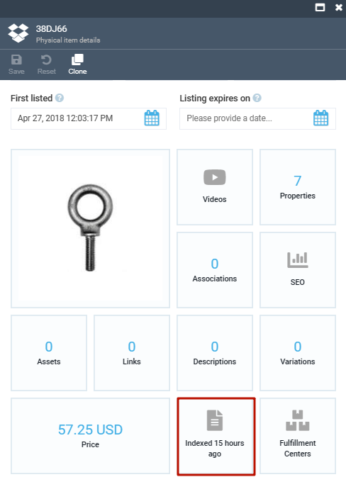

# Manage Product Availability

Product inventories are shown in Frontend Application:

* Under each product card in the catalog. You can apply **Show in stock** filter to see only products in stock.
* In the cart after adding the products. 
* When processing orders.

The product's availability displayed in the Frontend Application is determined by the information configured in:

* The **Catalog** module, where availability settings are established using switches.
* The **Inventory** module, storing the actual quantity of the product in stock. 

??? "See details"

    The diagram below illustrates the sequential process of how the product's availability is initially defined in the **Catalog** module through the use of switches, and then updated in the **Inventory** module with the specific stock quantity.
    

## Set availability

To set product's availability:

1. Click **Catalog** in the main menu.
1. In the next **Manage catalogs** blade, select the required catalog to open the **Categories and Items** blade.
1. Click the product you need to set availability for.
1. In the new blade, set the product's availability statuses by switching the toggles on and off in the order they are listed in the table below:

    | Switch | Status | Availability status|
    |---|---|---|
    | **Visible**  | <ul><li>Off</li><li>On</li></ul> | <ul><li>Sold out. **Can be purchased** and **Track inventory** switches do not influence the stock, even if on.</li><li>Depends on **Can be purchased**.</li></ul> |
    | **Can be purchased**  | <ul><li>Off</li><li>On</li></ul> | <ul><li>Out of stock. **Track inventory** does not influence the stock, even if on.</li><li>Depends on **Track inventory**.</li></ul> |
    | **Track inventory**  | <ul><li>Off</li><li>On</li></ul> | <ul><li>In stock.</li><li>Depends on the amount specified in the **Inventory** module.</li></ul> |

    !!! info 
        Track inventory switch can be applied to both digital and physical products. By default, the switch is off for digital products, on for physical ones. 

1. In the same blade, click on the **Fulfillment Centers** widget.

    

1. Fill in the following fields:

    

1. Click **Save** to save changes.   

The product's availability has been set.

## Check availability

To check product's availability:

1. Follow steps 1-3 from the instruction above.
1. In the next blade, click on the **Index** widget.

    {: width="300" height="300"}

1. Find the **availability** line. The **availability** statuses can be as follows:
    * **InStock**.
    * **OutOfStock**.
    * **SoldOut**.

    