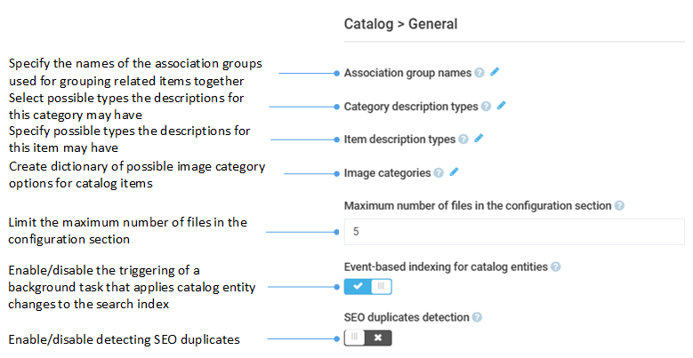
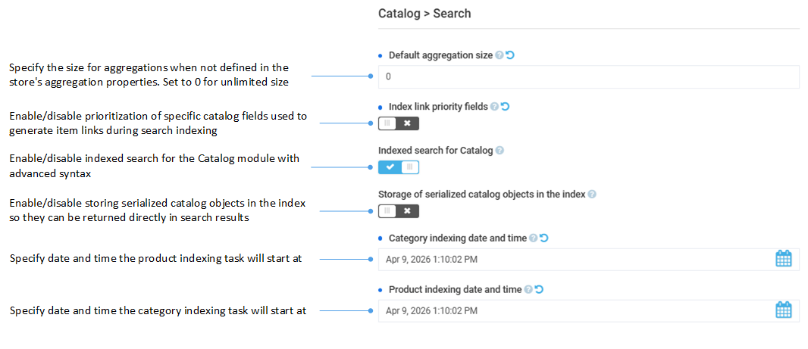
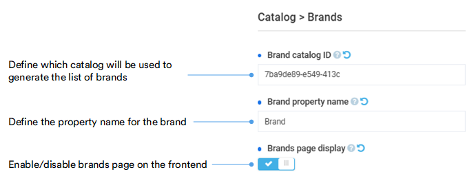

# Settings

The Catalog module settings include:

* [General settings.](#general-settings)
* [Search settings.](#search-settings)
* [Brands settings.](#brands-settings)

## General settings

To open general settings:

1. Click **Settings** in the main menu.
1. In the search field of the next blade, type **Catalog** to find the settings related to the module.
1. Click **General**.
1. Configure the following settings:

    {: style="display: block; margin: 0 auto;" }

1. Click **Save** in the toolbar to save the changes.

Your modifications have been applied.

## Search settings

To open Search settings:

1. Click **Settings** in the main menu.
1. In the search field of the next blade, type **Catalog** to find the settings related to the module.
1. Click **Search**.
1. Configure the following settings:

    {: style="display: block; margin: 0 auto;" }

1. Click **Save** in the toolbar to save the changes.

Your modifications have been applied.

## Brands settings

To open store-specific Brands settings:

1. Open **Stores** from the main menu.
1. In the next blade, select  your store.
1. In the next blade, click on the **Settings** widget or click on the **Brand settings** widget.
1. Find **Brands** settings in the left panel and configure the following:

    {: style="display: block; margin: 0 auto;" }

1. Click **Save** in the toolbar to save the changes.

Your modifications have been applied.

 
 
********

    <a href="../product-indexing">← Product indexing</a>
    <a href="../../store/overview">Stores module overview →</a>

