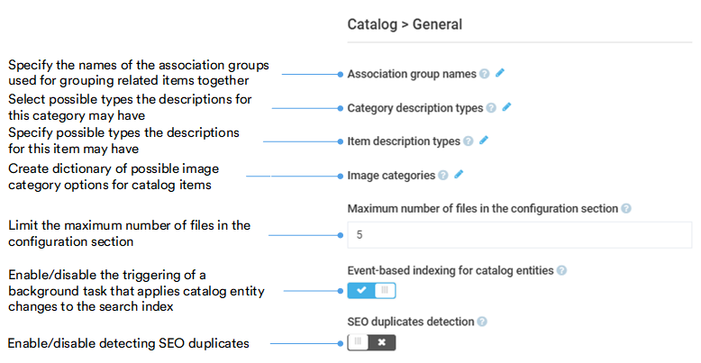
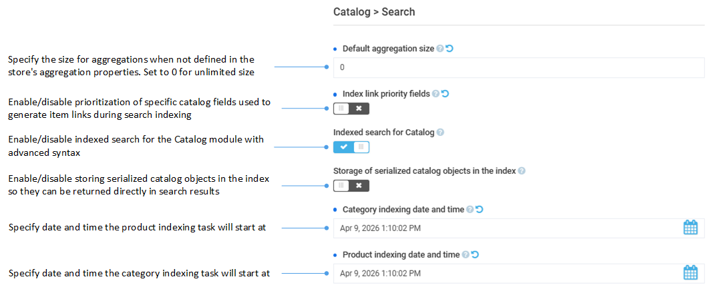
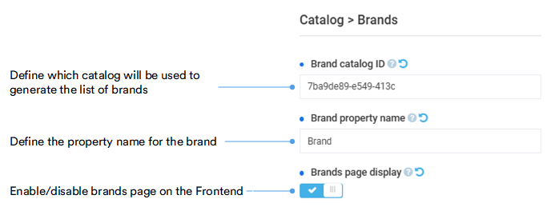

# Settings

The Catalog module settings include:

* [General settings.](#general-settings)
* [Search settings.](#search-settings)
* [Filtering properties.](#filtering-properties)
* [Brands settings.](#brands-settings)

## General settings

To open general settings:

1. Click **Settings** in the main menu.
1. In the search field of the next blade, type **Catalog** to find the settings related to the module.
1. Click **General**.
1. Configure the following settings:

    {: style="display: block; margin: 0 auto;" }

1. Click **Save** in the toolbar to save the changes.

Your modifications have been applied.

## Search settings

To open Search settings:

1. Click **Settings** in the main menu.
1. In the search field of the next blade, type **Catalog** to find the settings related to the module.
1. Click **Search**.
1. Configure the following settings:

    {: style="display: block; margin: 0 auto;" }

1. Click **Save** in the toolbar to save the changes.

Your modifications have been applied.

## Filtering properties

**Filtering properties** define the attribute, range, and price-range filters that drive faceted browsing on the Frontend. They are configured per store and stored as a store-level setting.

You can edit filtering properties in two equivalent places:

* The **Aggregation properties** widget on the store page. This is the recommended editing surface for adding, removing, and reordering filters.
* The **Filtering properties** entry under the store's **Settings** > **Catalog** > **Search** section.

Both views read and write the same value, so changes made in one are visible in the other.

### Automatic migration from earlier versions

Earlier versions of the Platform stored this configuration as a store dynamic property named **FilteredBrowsing**. The **Catalog** module runs a one-time automatic migration on first startup. For every store with a non-empty value, the existing configuration is copied into the new setting. The migration runs only once and never overwrites manual edits.

After upgrade, the legacy dynamic property record is left in place but is no longer used. You can delete it without losing data.

For partner deployments that need a coordinated database migration, SQL scripts for SQL Server, MySQL, and PostgreSQL are available in the **Catalog** module repository at **docs/migrations/scripts/**.

## Brands settings

To open store-specific Brands settings:

1. Open **Stores** from the main menu.
1. In the next blade, select  your store.
1. In the next blade, click on the **Settings** widget or click on the **Brand settings** widget.
1. Find **Brands** settings in the left panel and configure the following:

    {: style="display: block; margin: 0 auto;" }

1. Click **Save** in the toolbar to save the changes.

Your modifications have been applied.

 
 
********

    <a href="../product-indexing">← Product indexing</a>
    <a href="../../store/overview">Stores module overview →</a>

