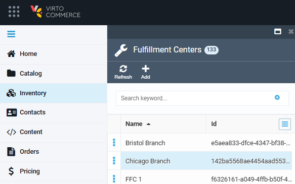
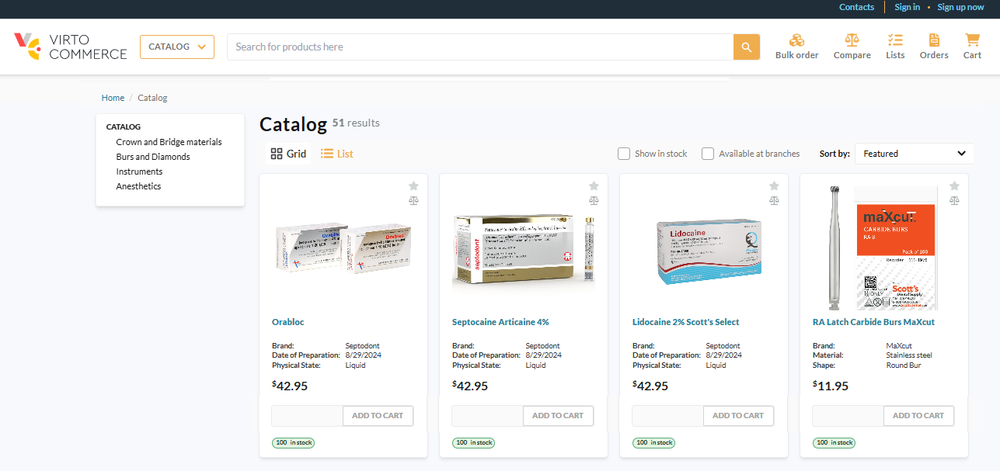

# Import Products, Prices and Stock Quantities from CSV

To bulk add new products, along with their prices and stock quantities at each fulfillment center, you can use the CSV file import option.

!!! note
    Importing products to catalogs requires the preinstalled [Catalog CSV Import module](https://github.com/VirtoCommerce/vc-module-catalog-csv-import).

Importing information from a CSV file includes the following steps:

1. [Preparing a CSV file.](#prepare-csv-file)
1. [Importing your CSV file to catalog.](#import-csv-file-to-catalog)

## Prepare CSV file

Let's create a CSV file containing all the necessary columns, i.e., product name, Id, SKU, price, price list Id, etc. To create a new catalog within this guide, we will [download this sample file](DentalDemo-Catalog.csv) to use as a template. 

1. Fill in the products names and SKUs.

1. Go to **Pricing** --> **Price lists** to copy the Id of the price list to clipboard:

    

    !!! note
        If not set by default, you can find the Price list Id column by clicking the hamburger menu in the top right corner and then checking **Id**:

        {: width="400"}

    Paste the copied price list Id to the **PriceListId** column.

    

1. Fill the **CategoryPath** column to specify the product's separate category in a catalog as follows:

    

    !!! note
        You can create categories and subcategories from the CSV file. You will need to add the names of categories (for example, **Сategory 1**) and subcategories (for example, **Сategory 1/Subcategory 1**). In our example, we use our manually created structure.

    !!! note
        If you import new products from a file without specifying either the category id or the category path, the default is the root directory - the catalog.

1. Go to **Catalog** --> Your catalog to copy the category Id by right-clicking:

    

    Paste it to the **CategoryID** column:

     

1. Go to **Inventory** to copy the fulfillment center ID:
    
    

    Paste it to the **FulfillmentCenterId** column:

    

    You may also specify quantities in stock in the **Quantity** column.

1. Fill the **PrimaryImage** column with links to images to provide a product's image.
1. Specify **ListPrice** to display regular product price.

Filling in the above columns is sufficient to start the import, but you can fill in other columns according to your needs.

## Import CSV file to catalog

To import your CSV to your catalog:

1. Click **Catalog** in the main menu.
1. In the next blade, select your catalog.
1. Click **Import** in the top toolbar.
1. In the next blade, click **VirtoCommerce CSV import**.
1. In the next blade: 
    1. Select **Comma** as a delimeter from the dropdown list.
    1. Upload your CSV file.
    1. Click **Map columns**.
1. In the next blade, check that the product properties are correctly mapped to the CSV columns. Click **OK**.
1. In the **Import catalog from csv** blade, click **Start import**.

The catalog import begins. When the import is finished, you can see that your catalog is filled with products. Each product has a complete description:

## View results on frontend

1. In the main menu, click **Stores**.
1. In the next blade, click on the required store (**Dental Demo Store** in our case).
1. In the next blade, click **Open in browser** in the top toolbar.

{: width="750"}

The CSV file columns are displayed as follows:

