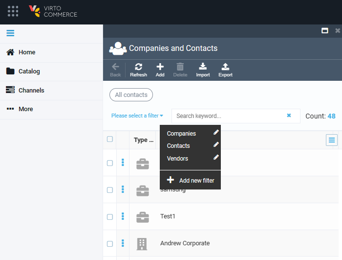
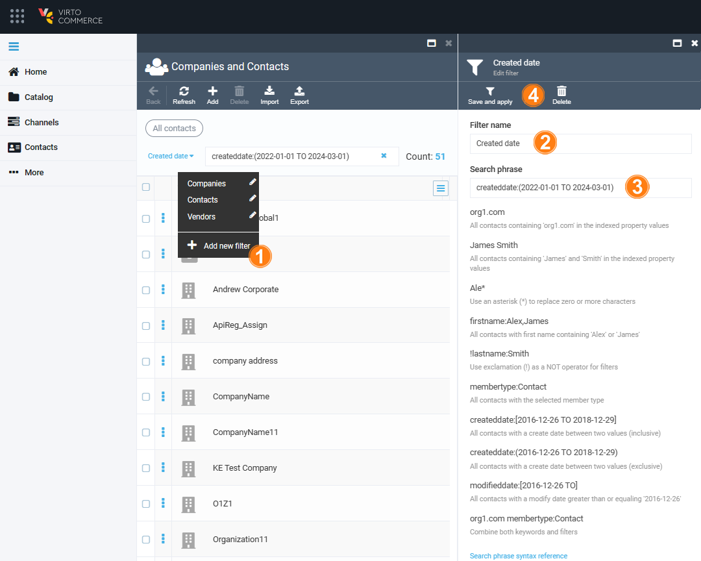
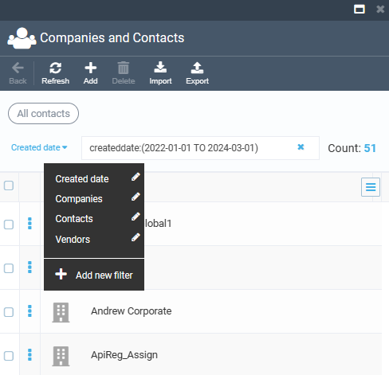
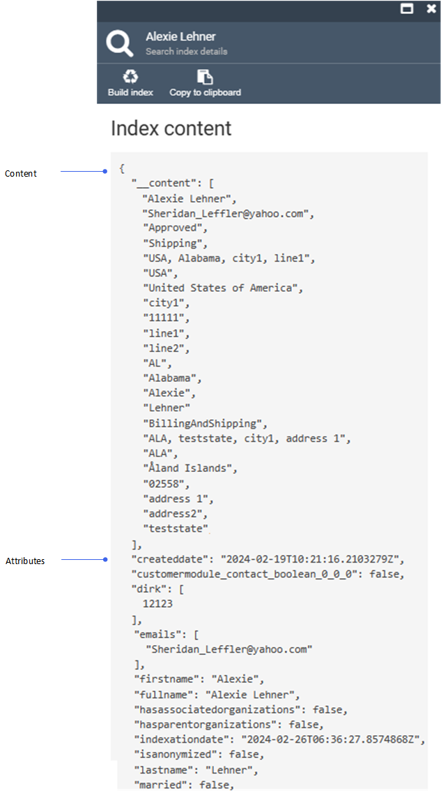
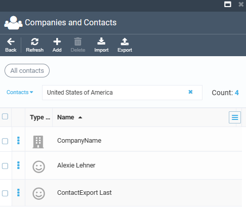

# Filtering and Search Options

To find the required contacts, you can:

* [Use the default filters.](filtering-options.md#default-filters)
* [Add your own filter.](filtering-options.md#new-filter)
* [Search items by keyword.](filtering-options.md#keyword-search)

## Default filters

The default filter allows users to filter the contact list by:

* Companies.
* Contacts.
* Vendors.

## New filter

To add a new filter:

1. Click **Add new filter** from the dropdown menu.
1. In the next blade, enter the filter name.
1. Enter the search phrase.
1. Click **Save and apply** in the toolbar. In our example, we want to see all the contacts created between January 1, 2022-01-01 and March 1, 2024.

    

1. You see that 51 contacts have been created within the specified time period. The newly created filter appears in the filters list.

## Keyword search

Keyword search operates based on:

* **Content**: This type of filter uses the index content , is case insensitive and supports wildcards. 
* **Attributes**: This type of filter uses the index attributes, is case insensitive and doesn't support wildcards.

Let's search for all the contacts from the United States of America. Enter **United States of America** to the keyword search field and click <kbd>Enter</kbd>. You will see all the contacts with the United States of America specified in the index content:

 
 
********

    <a href="../managing-contacts">← Managing companies and contacts</a>
    <a href="../settings">Contacts module settings →</a>

