# Manage Contacts

Managing contact entities (companies, employees, customers, and vendors) includes:

* [Adding contacts.](#adding-contacts)
* [Editing company info.](#edit-company-info)
* [Editing customer info.](#edit-customer-info)
* [Inviting contacts.](#invite-contacts)
* [Deleting contacts.](#deleting-contacts)
* [Exporting contacts.](#export-contacts)
* [Importing contacts.](#import-contacts)
* [Updating contacts.](#import-contacts)
* [Sharing contacts.](#share-contacts)

## Add contacts

To add a contact:

1. Click **Contacts** in the main menu.
1. In the next blade, click **Add** in the toolbar to open the **New contact** blade.
1. Select the entity you need and start creating your contact. We will use **Organization** as an example. Adding employees, contacts, and vendors is a similar process.

	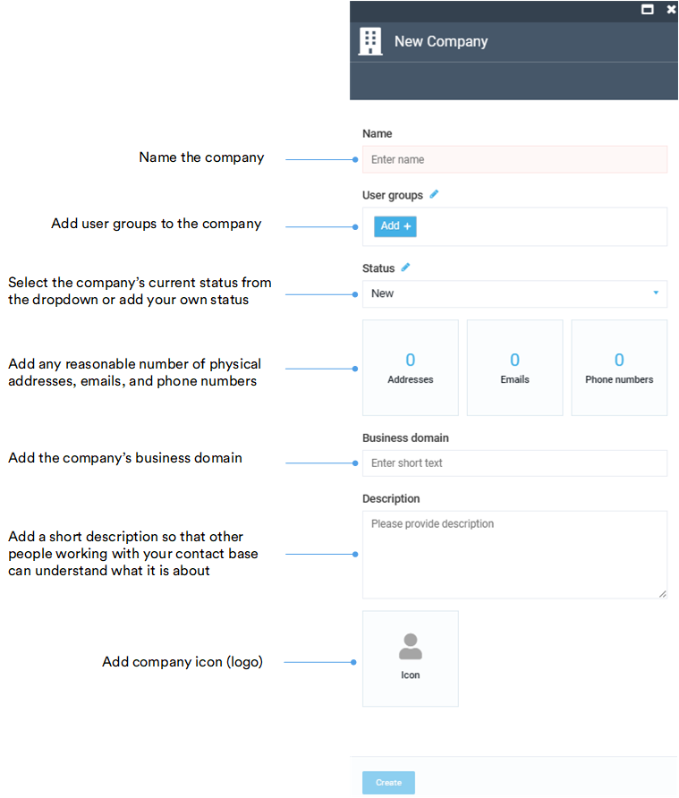{: style="display: block; margin: 0 auto;" }

	Assigning organizations or users to particular user groups enables showing personal offers to them.

	 
	{: width="25"} [Assigning user groups to products and categories](../catalog-personalization/user-groups.md)
	
	{: width="25"} [Managing personal prices](../pricing/adding-new-assignment.md)
	
	 

1. Click **Create** to save the changes.

The company appears in the **Companies and contacts** list.

## Edit company info

To edit a previously added company info:

1. Click **Contacts** in the main menu.
1. In the **Companies and contacts** blade, click the three dots to the left of the required contact's name and click **Manage** in the popup menu. 
1. In the next blade, update the contact, for example, change the email account by clicking the **Accounts** widget. 
1. Click **Save** in the toolbar to save the changes.

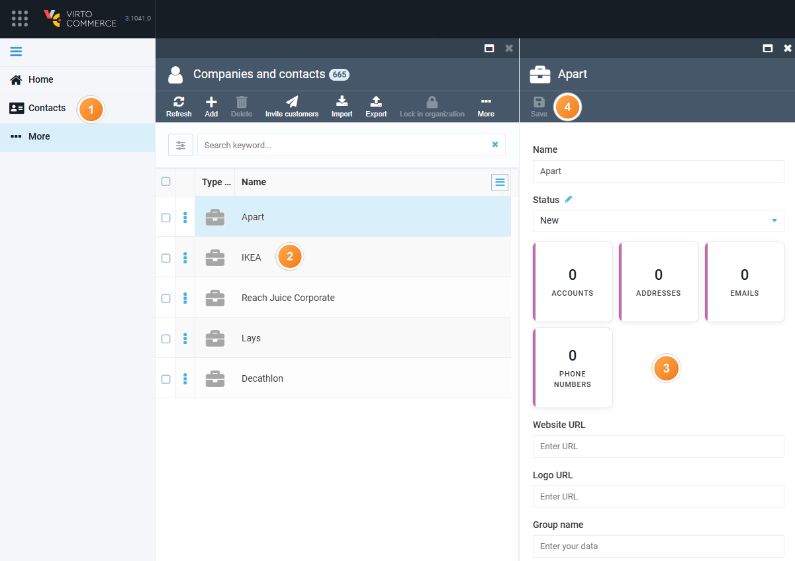{: style="display: block; margin: 0 auto;" }

!!! note
	Editing the **Company details** blade allows you to upload and assign assets (images, documents, etc.) to this company. Use the **Assets** widget that appears when editing the company details. 

The contact has been edited.

## Edit customer info

To edit a previously added customer info:

1. Click **Contacts** in the main menu.
1. In the **Companies and contacts** blade, click the required contact's name.
1. In the next blade, configure the following:

	| Setting | Description |
	| --- | --- |
	| First name, last name, full name | Enter the customer's first name, last name, and full name. |
	| Status | Select the account status from the dropdown:<ul><li>Approved</li><li>New</li><li>Locked</li><li>Invited</li><li>Deleted</li><li>Rejected</li></ul> |
	| User groups | Add one or more user groups if needed, for example wholesaler or VIP. |
	| Title | Enter the customer's job title. |
	| Accounts | Manage the current user's accounts:<ul><li>Add</li><li>Link</li><li>Unlink</li><li>Delete</li></ul> |
	| Organization membership | Assign the contact to an organization:<ul><li>Select the organization from the dropdown.</li><li>Add roles.</li><li>Lock or unlock the account.</li></ul> |
	| Emails | Add one or more email addresses. |
	| Orders | View the list of orders the customer has submitted.  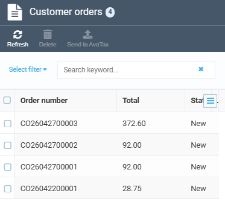 |
	| Addresses | Add, edit, or delete the customer's billing and shipping addresses. |
	| Back in stock subscriptions | View the list of products the customer wants to be notified about when they are restocked.  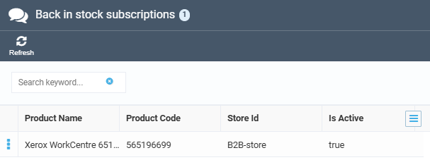  |
	| Loyalty balance | View the loyalty operations log with the points earned and redeemed for each order.  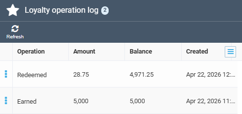 |
	| Member of companies | Assign one or multiple organizations to the the contact by selecting them from the dropdown, without assigning a role.   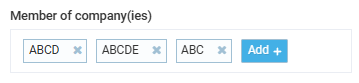   On the Frontend, multiple companies assigned to the user are displayed as follows:   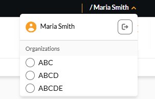 |
	| Default company | Set a default company for an employee, so that they can log in to that company by default upon first login or after changing the default company. |
	| Birth date | Select the customer's date of birth. |
	| Time zone | Select the customer's time zone from the dropdown. |
	| Default language | Select the customer's preferred language.   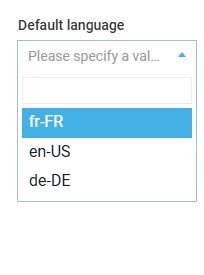 |
	| Currency | Select the customer's preferred currency.   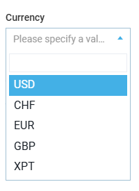 |
	| Taxpayer ID | Enter the customer's taxpayer identification number. |
	| Preferred communication channel | Enter the customer's preferred communication channel, for example email or phone. |
	| Preferred delivery method | Select the customer's preferred delivery method. |
	| About | Enter additional information about the contact. |
	| Phone numbers | Add one or more phone numbers. |
	| Dynamic properties | Add any dynamic property, for example sex or marital status.   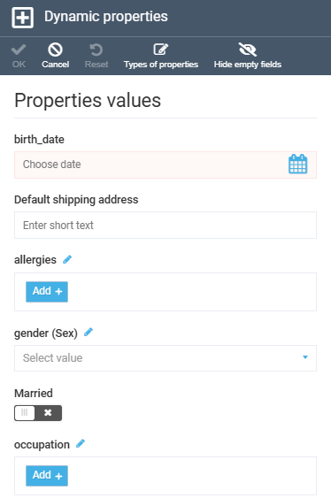|
	| Indexed date | Manage the search index for the contact:<ul><li>View the last indexed date.</li><li>Build the index.</li><li>Copy the index content to the clipboard.</li></ul> |
	| Icon | Attach a photo for the contact.   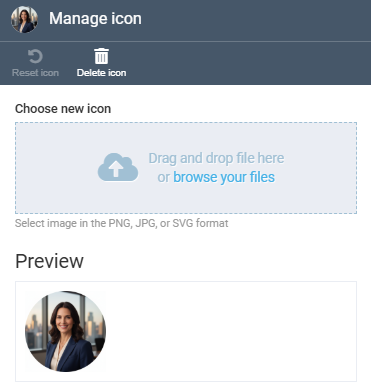   Alternatively, you can attach photo via the [user profile](../user-profile.md). |

1. Click **Save** in the toolbar.

Your modifications have been saved.

### Manage account

To manage customer or employee accounts:

1. Click **Contacts** in the main menu.
1. In the **Companies and contacts** blade, click the required contact's name.
1. In the next blade, click the **Accounts** widget.
1. In the next blade, select the account to manage.
1. In the next blade, use the toolbar to:

	1. Change password on the user's behalf.
	1. Lock the account.
	1. [Log in on the user's behalf](../security/login-on-behalf.md).

1. In the next blade, configure the following:

	| Setting | Description |
	| --- | --- |
	| Is administrator | Enable or disable administrator privileges for the account. |
	| Login | Edit the account login. |
	| Email | Edit the account email address. |
	| Verified | Enable it for verified email addresses, or resend the verification link. |
	| Status | Select the account status from the dropdown:<ul><li>Approved</li><li>Deleted</li><li>New</li><li>Rejected</li></ul> |
	| Account type | Select the account type from the dropdown, or add a custom one:<ul><li>Administrator</li><li>Customer</li></ul> |
	| Locked date | View the date the account was locked. |
	| Last login date | View the date of the account's last sign-in. |
	| Container (store) | Select the store the account belongs to from the dropdown. |
	| Roles | [Assign roles to the account](../security/managing-users.md#assign-roles-to-users) and view the list of assigned roles. |
	| Changes | View the change log for the account. |
	| API key | [Generate an API key for authenticating the account's API requests](../security/api-key.md). |
	| Active sessions | [Manage the account's sessions](../security/active-sessions.md):<ul><li>View active sessions.</li><li>Terminate a single session.</li><li>Terminate all sessions.</li></ul> |

1. Click **Save** in the toolbar.

Your modifications have been saved.

## Invite contacts

To invite a user:

1. Click **Contacts** in the main menu.
1. In the **Companies and contacts** blade, click **Invite** in the toolbar. 
1. In the next blade, configure the following:

	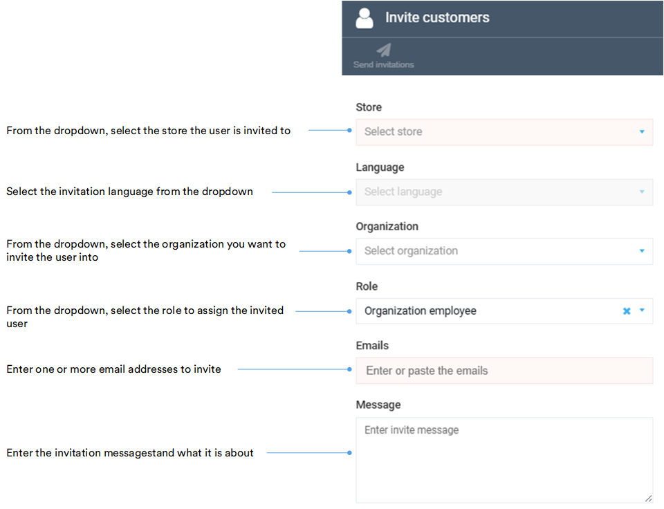

1. Click **Invite** in the toolbar.

Your invitations have been sent.

## Delete contacts

To delete a contact:

1. Click **Contacts** in the main menu.
1. In the **Companies and contacts** blade, check the contact you need to delete. 
1. Click **Delete** in the toolbar.
1. Type **Yes** to confirm your action.

The contact has been deleted.

## Export contacts

!!! note
	Exporting contacts requires the preinstalled [Customer Export and Import module](../customer-export-import/overview.md). 

To export contacts into a CSV file:

1. Click **Contacts** in the main menu.
1. In the next **Companies and contacts** blade, check the required contact (vendor/organization/person).

	!!! note
		If you do not check any contact, all the contacts of all the organizations will be exported into a CSV file.

1. Click **Export** in the toolbar and confirm your action.
1. In the next blade, click the generated links to download the contacts:

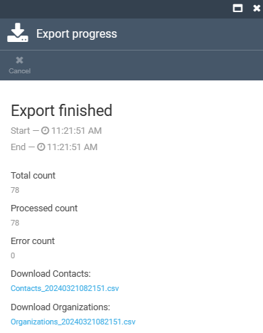{: style="display: block; margin: 0 auto;" }

The contacts have been saved as a CSV file.

## Import contacts

!!! note
	Importing contacts requires the preinstalled [Customer Export and Import module](../customer-export-import/overview.md). 

To import contacts into the Contacts module:

1. Prepare a CSV file of contacts. We recommend to [export a sample CSV file](managing-contacts.md#export-contacts) and use it as a template.
1. Click **Contacts** in the main menu.
1. In the next **Companies and contacts** blade, click **Import** in the toolbar.

	!!! tip
		In this step, you can specify an organization to import your contacts into. 

1. In the next blade, select the data type from the dropdown list (Contacts or Organizations).
1. Browse your file or drag and drop it to the specified field.

	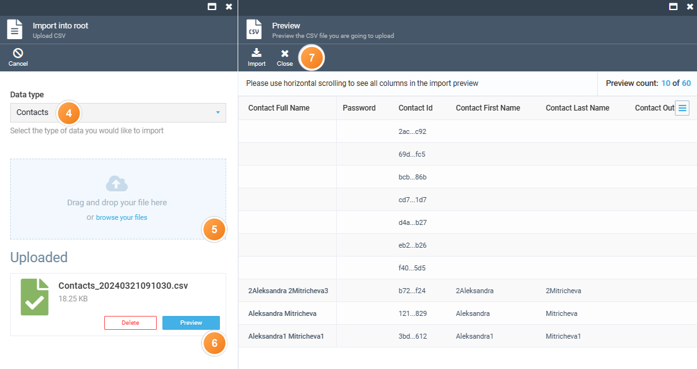{: style="display: block; margin: 0 auto;" }

1. After uploading files, click **Preview** to open the uploaded contacts in the next blade.
1. Verify the result. Click **Import** in the toolbar to complete the process. Otherwise, click **Close**.
1. Confirm your action.

Your contacts have been uploaded.

## Update contacts

The procedure for updating contacts is similar to the one for [importing contacts](managing-contacts.md#import-contacts). The system finds organizations by Id or outer Id and updates them. 

## Share contacts

Contact URLs include the member ID slug, allowing for easy sharing with colleagues or partners:

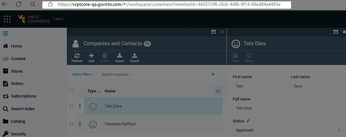{: style="display: block; margin: 0 auto;" }

You can also share company name and company ID by copying them from the dropdown menu:

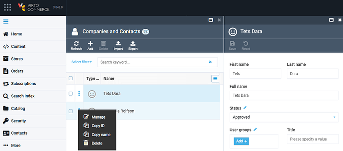{: style="display: block; margin: 0 auto;" }

 
 
********

    <a href="../overview">← Contacts module overview</a>
    <a href="../filtering-options">Filtering options →</a>

