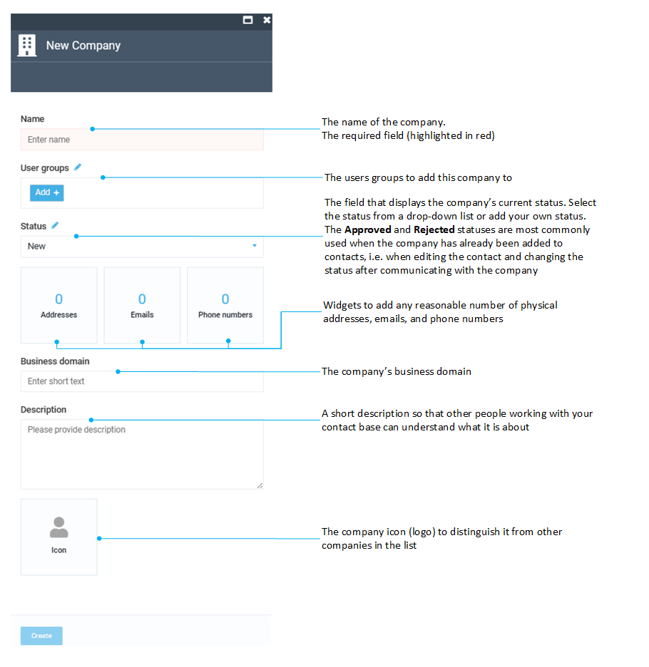

# Manage Contacts

Managing contact entities (companies, employees, customers, and vendors) includes:

* [Adding contacts.](managing-contacts.md#adding-contacts)
* [Editing contacts.](managing-contacts.md#editing-contacts)
* [Deleting contacts.](managing-contacts.md#deleting-contacts)
* [Exporting contacts.](managing-contacts.md#export-contacts)
* [Importing contacts.](managing-contacts.md#import-contacts)
* [Updating contacts.](managing-contacts.md#import-contacts)

## Add Contacts

To add a contact:

1. Click **Contacts** in the main menu.
1. In the next blade, click **Add** in the toolbar to open the **New Contact** blade.
1. Select the entity you need and start creating your contact. We will use **Organization** as an example. Adding employees, contacts, and vendors is a similar process.

	

	Assigning organizations or users to particular user groups enables showing personal offers to them.

	{: width="25"} [Assigning user groups to products and categories](../catalog-personalization/user-groups.md)
	
	{: width="25"} [Managing personal prices](../pricing/adding-new-assignment.md)

1. Click **Create** to save the changes.

The company appears in the **Companies and Contacts** list.

## Edit Contacts

To edit any previously added contact:

1. Click **Contacts** in the main menu.
1. In the **Companies and Contacts** blade, click the three dots to the left of the required contact's name and click **Manage** in the popup menu. 
1. In the next blade, update the contact and click **Save** in the toolbar to save the changes.

{: width="650"}

!!! note
	Editing the **Company details** blade allows you to upload and assign assets (images, documents, etc.) to this company. Use the **Assets** widget that appears when editing the company details. 

The contact has been edited.

## Delete Contacts

To delete a contact:

1. Click **Contacts** in the main menu.
1. In the **Companies and Contacts** blade, check the contact you need to delete. 
1. Click **Delete** in the toolbar.
1. Confirm your action.

The contact has been deleted.

## Export Contacts

!!! note
	Exporting contacts requires the preinstalled [Customer Export and Import module](../customer-export-import/overview.md). 

To export contacts into a CSV file:

1. Click **Contacts** in the main menu.
1. In the next **Companies and Contacts** blade, check the required contact (vendor/ organization/ person).

	!!! note
		If you do not check any contact, all the contacts of all the organizations will be exported into a CSV file.

1. Click **Export** in the top toolbar and confirm your action.
1. In the next blade, click on the generated links to download the contacts:

The contacts have been saved as a CSV file.

## Import Contacts

!!! note
	Importing contacts requires the preinstalled [Customer Export and Import module](../customer-export-import/overview.md). 

To import contacts into the Contacts module:

1. Prepare a CSV file of contacts. We recommend to [export a sample CSV file](managing-contacts.md#export-contacts) and use it as a template.
1. Click **Contacts** in the main menu.
1. In the next **Companies and Contacts** blade, click **Import** in the top toolbar.

	!!! tip
		In this step, you can specify an organization to import your contacts into. 

1. In the next blade, select the data type from the dropdown list (Contacts or Organizations).
1. Browse your file or drag and drop it to the specififed field.

	

1. After uploading files, click **Preview** to open the uploaded contacts in the next blade.
1. Verify the result. Click **Import** in the top toolbar to complete the process. Otherwise, click **Close**.
1. Confirm your action.

Your contacts have been uploaded.

## Update Contacts

The procedure for updating contacts is similar to the one for [importing contacts](managing-contacts.md#import-contacts). The system finds organizations by Id or outer Id and updates them. 
