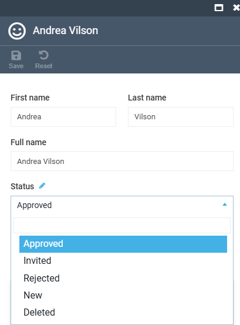
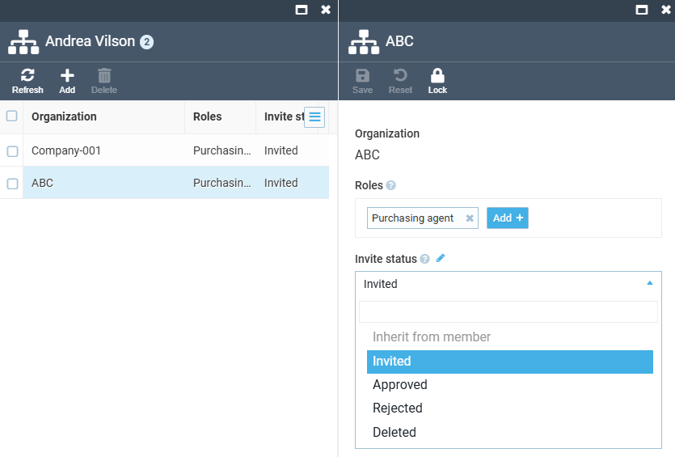

# Manage Organization Membership Status

A contact can hold a different status in every organization they belong to, instead of one status for the whole account. This lets you invite, approve, or block a customer's access to one company without changing their standing anywhere else.

## Requirements

* Customer module 3.1021.0 or higher.
* Profile Experience API module 3.1015.0 or higher.

## Status fields

Two independent fields control an organization's access, with different value sets:

-   __Status (contact record, account-wide, default):__

    ---

    

-   __Invite status (each contact's organization only):__

    ---

    

For each organization, the Platform resolves access in this order:

1. If the membership's own **Invite status** is set to anything but **Inherit from member**, that value governs access to this organization.
1. Otherwise, the Platform falls back to the contact's account-wide **Status**.
1. If neither is set, the contact is treated as **Approved**.

Wherever the resolved value is **Invited**, **Rejected**, or **Deleted**, sign-in and access to that organization are blocked. **Approved** is not blocked.

!!! warning
    After this update, a contact whose account-wide **Status** is **Invited**, **Rejected**, or **Deleted**, with no per-organization override, loses access to every organization they belong to, not only the one they were originally blocked from. Audit any contact in this state before rolling out to production. A NULL or unrecognized **Status** is treated as **Approved** and is unaffected.

Keep this resolution order in mind whenever a contact's access to a specific organization looks unexpected.

## View contact's organization memberships

To see every organization a contact belongs to, and their status in each:

1. Click **Contacts** in the main menu and open the **Companies and contacts** grid.
1. Click the required contact row.
1. Click the **Organization memberships** widget.

The widget lists every organization the contact belongs to, along with its current **Invite status**.

!!! note
    The **Invite status** column shows the raw stored value (for example, **Approved**), not a Frontend-mapped label.

## Set or change membership's status

To change a contact's access to one specific organization:

1. From the **Organization memberships** grid, click the membership row.
1. In the membership blade, set **Invite status**:

    | Value | Meaning |
    | --- | --- |
    | Inherit from member | No override. Falls back to the account-wide **Status**. |
    | Approved | Full access to this organization. |
    | Invited | Blocks access. Pending acceptance. |
    | Rejected | Blocks access. Can be re-invited. |
    | Deleted | Blocks access. Can be re-invited. Set automatically when an invite is revoked. |

1. Click **Save** in the toolbar.

The contact's access to this organization is updated.

## Revoke pending invitation

To revoke an invitation before the invitee accepts it:

1. Open the affected membership row.
1. Set **Invite status** to **Deleted**.
1. Click **Save**.

The invitation is revoked. This is the same action a maintainer's **Revoke invite** button performs on the Frontend. Since **Rejected** and **Deleted** are the only re-invitable values, sending a new invitation afterward reuses this same membership row instead of creating a duplicate.

## Notification templates

The following notification types under **Notifications → Notification list** refer to this feature:

* **Customer invitation email notification**.
* **Organization invitation email notification (new user)**.
* **Organization invitation email notification (existing user)**.

The previous invite notification is now orphaned as **Unregistered notification** and no longer fires.

!!! warning
    Any store-level template customization made to the old notification type stays attached to the orphaned notification and is never sent again. The three new types start on their predefined, English-only templates until re-authored per store and language.

Review and customize these templates before the feature reaches customers.

{: width="25"} [Managing notification templates](../notifications/notification-templates.md)

## Configure allowed status values

The values offered in **Invite status** are configured the same way as other [contact entity statuses](settings.md#statuses), under **Settings → Customer → Statuses → Organization membership statuses**. The dictionary holds exactly **Approved**, **Deleted**, **Invited**, **Rejected**. **Inherit from member** is a sentinel option on the membership blade, not a stored value.

Add or remove values there to change what the **Invite status** picker offers.
 
 
{: width="25"} [Managing company members on the Frontend](/storefront/user-guide/latest/account/company-members)

 
 
********

    <a href="../managing-organization-roles">← Managing organization-scoped roles</a>
    <a href="../filtering-options">Filtering options →</a>

