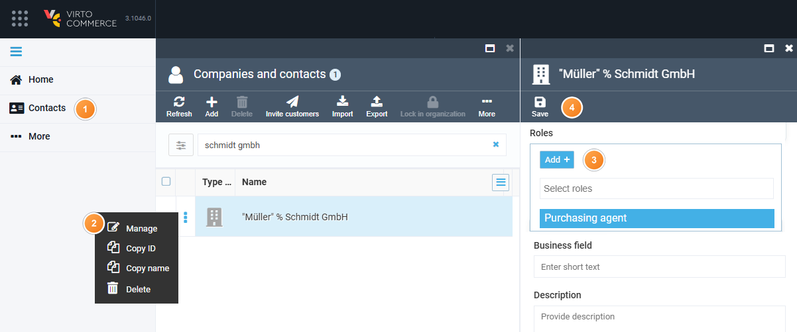
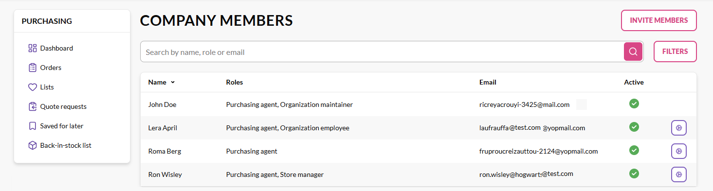
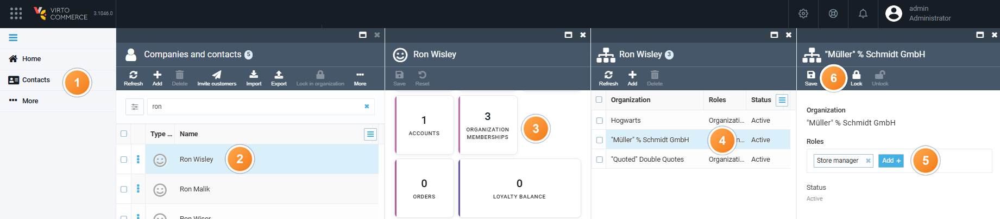
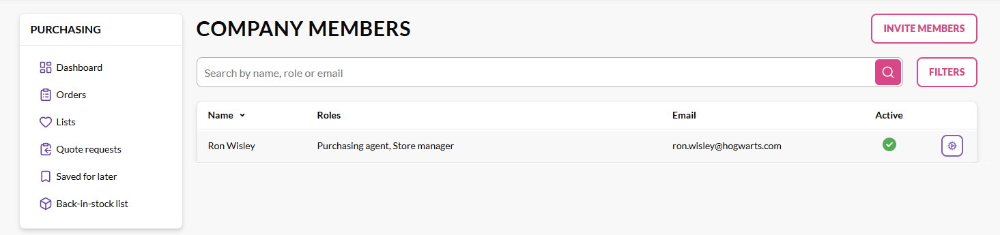

# Manage Organization-Scoped Roles

Organization-scoped roles let you grant access to every employee of a company at once, instead of assigning the same role to each member by hand.

A member's effective permissions are the union of three role sources, re-evaluated each time they sign in:

* [Global roles](../security/roles-and-permissions.md#create-new-role-and-assign-permissions) are assigned to the user account itself in the Security module.
* [Organization roles](#assign-organization-level-role) are assigned to a whole organization and inherited by all its employees.
* [Membership roles](#assign-membership-role) are assigned to one person within one organization.

In this article we are going to explore the organization and membership roles assigned via the Contacts module.

## Assign organization-level role

To assign a role to every employee of an organization at once:

1. Click **Contacts** in the main menu.
1. In the next blade, click the three dots to the left of the required organization and select **Manage** from the popup menu.
1. In the next blade, locate the **Roles** field, click **Add** and select a role from the dropdown.
1. Click **Save** in the toolbar.

{: style="display: block; margin: 0 auto;" }

All the company members receive a purchasing agent role:

{: style="display: block; margin: 0 auto;" }

Only roles allowed by the [Organization roles whitelist](#restrict-role-assignment) appear in the dropdown. Every employee of the organization now inherits the role's permissions, with no per-member action needed. To revoke it from everyone at once, remove the role's chip and save.

!!! warning
    Employees must sign in again. Effective permissions are recalculated at sign-in. An employee with an open Frontend session keeps their previous permissions until they sign out and back in. The change is applied on the server immediately, so only the active session is stale.

## Assign membership role

To assign a role to one member within one organization:

1. Click **Contacts** in the main menu.
1. In the next blade, open the required contact.
1. In the next blade, click the **Organization memberships** widget.
1. In the next blade, select the organization.
1. In the next blade, click **Add** to add the roles to the **Roles** field.
1. Click **Save** in the toolbar.

    {: style="display: block; margin: 0 auto;" }

The role has been added to the contact.

Global roles live on the account. Membership roles are set per organization in the **Roles** field of the membership blade. The member's effective access is the union of this membership role, any organization-level roles they inherit, and their global roles.

## Restrict role assignment

To edit a whitelist:

1. Click **Settings** in the main menu.
1. In the search field of the next blade, type **Roles** to find the settings related to the feature.
1. Click {: width="25"} to edit:

    * **Organization roles whitelist**: the roles selectable in an organization's **Roles** field.
    * **Membership roles whitelist**: the roles selectable in a member's **Roles** field.

1. In the editor blade, click **Add** to add a role, or select a row and click **Delete** to remove one.
1. Click **Save** in the editor toolbar.

!!! tip
    After editing a whitelist, click **Reset cache** in the Settings toolbar and reload the page. The role pickers read the whitelist through the settings cache, so a newly added or removed role appears in the dropdowns only after the cache refreshes.

 
 
********

    <a href="../managing-contacts">← Managing companies and contacts</a>
    <a href="../filtering-options">Filtering options →</a>

