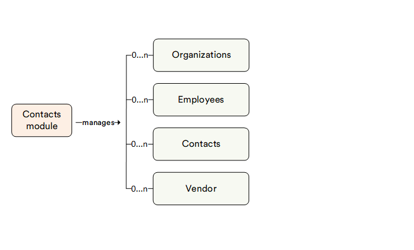

# Overview

The Contacts module allows you to manage various profiles within Virto Commerce, which includes companies, vendors, and individual customers.

## Key features

The diagram below illustrates the interconnections among various key entities within the Contacts module:

The Contacts module features are:

* **Many-to-many company entity hierarchy:** Each company entity can contain multiple companies, along with individual users.
* **Link to user accounts:** You can link your contact profiles to the account credentials (e.g. email or username) they use to shop in your store.
* **Easy contact management:** You can create, link, edit, or remove your contacts with just a few clicks.
* **User groups:** You can create groups that include specific users. This can be useful for targeting promotions, offering special prices to specific customers, etc. 
    
    {: width="25"} [User groups](https://docs.virtocommerce.org/new/user-guide/catalog-personalization/user-groups/)

* **Connection to Storefront:** You can link all your contacts and their hierarchy to the Storefront application.

