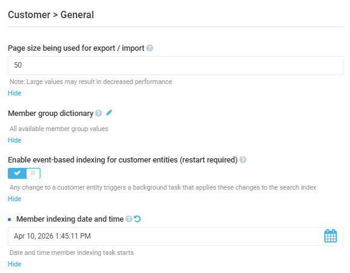
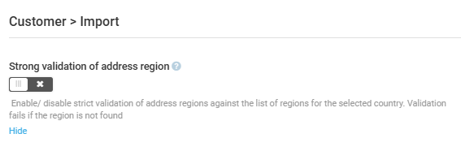
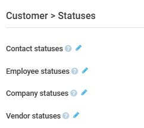
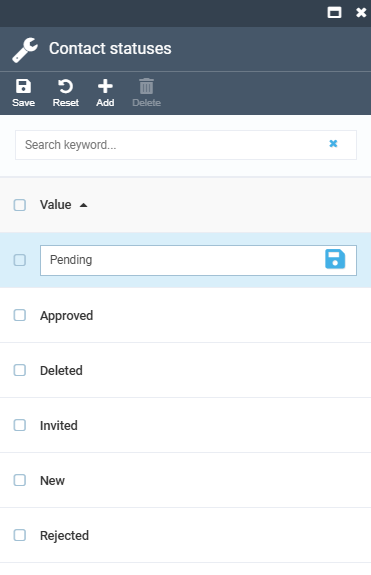
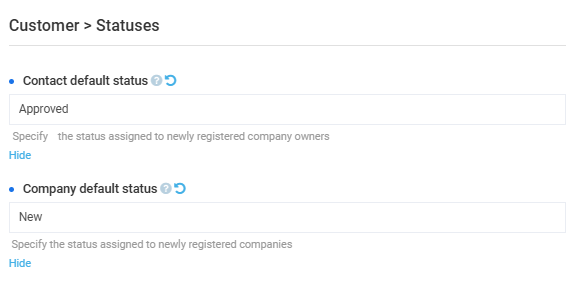

# Settings

The module settings include:

* [General settings).](#general-settings)
* [Import settings).](#import)
* [Settings for contact entities statuses.](#statuses)

## General settings

To configure general settings:

1. Click **Settings** in the main menu.
1. In the search field of the next blade, type **Customer** to find the settings related to the module.
1. Select **General**.
1. In the next blade, configure the following settings:

    {: style="display: block; margin: 0 auto;" }

1. Click **Save** in the toolbar to save the changes.

Your modifications have been applied.

## Import settings

To configure import settings:

1. Click **Settings** in the main menu.
1. In the search field of the next blade, type **Customer** to find the settings related to the module.
1. Select **Import**.
1. In the next blade, enable or disable strong validation of address region:

    {: style="display: block; margin: 0 auto;" }

1. Click **Save** in the toolbar to save the changes.

Your modifications have been applied.

## Statuses

To add and edit statuses for various contact entities globally: 

1. Click **Settings** in the main menu.
1. In the search field of the next blade, type **Customer** to find the settings related to the module.
1. Select **Statuses**.
1. In the next blade, select a status to configure and click {: width="25"}:

    
    
1. In the next blade, you can search, add, and delete statuses. In the example below, we add the **Pending** status to the **Company** entity:

    {: style="display: block; margin: 0 auto;" }

1. Click {: width="25"} to save the changes.

Your modifications have been saved.

To edit store-specific statuses:

1. Open **Stores** from the main menu.
1. In the next blade, select  your store.
1. In the next blade, click on the **Settings** widget.
1. Find **Customer** settings in the left panel and configure the following:

    {: style="display: block; margin: 0 auto;" }

 
 
********

    <a href="../filtering-options">← Filtering options</a>
    <a href="../../cart/overview">Cart module overview →</a>

