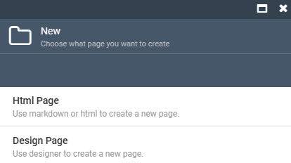

# Blogs

Clicking on the **Blogs** widget opens the list of the all blogs in your Storefront. In the Content module, the blogs are folders with an unlimited number of files (posts) in them. 

From the **Blogs List**, you can:

* Add new blogs.
* Upload new blogs.
* Delete blogs.

Click on the three dots to left of the blog name to:

* Download it.
* Copy its link.
* Delete it.

{: width="450"}

Each blog contains an unlimited number of posts. The posts can have the following extensions:

* **.page** - for posts that have been created in Page Builder and published.
* **.page-draft** - for posts that have been created in Page Builder, but have not yet been published.
* **.md** - for pages that have been created using markdown or html.

## Create blog

New blogs can be:

* Uploaded (see image above)
* Added by clicking **Add blog** in the toolbar of the **Blogs List** blade. The following fields should be filled in:

  

!!! note 
    Edit the fields to fill in by clicking **Manage Metadata properties** in the toolbar.

## Create post

To create new post in your blog:

* Use the upload feature (see image above).
* [Use Virto Commerce Page Builder](../page-builder/overview.md) to build posts from individual blocks by clicking **Design Page** in the blade below.
* Use markdown or html by clicking **Html Page** in the blade below.

### Code-based creation

To create a new post using markdown or html, fill in the following fields in the **Markdown** tab: 

## Edit posts with .page and .page-draft extensions

In the **Blogs list** blade, select the desired post and edit the following fields:

## Edit posts with .md extension

In the **Blogs List** blade, select the desired page and edit it as markdown or html:

 
 
********

    <a href="../managing-linklists">← Managing link lists</a>
    <a href="../settings">Settings →</a>

