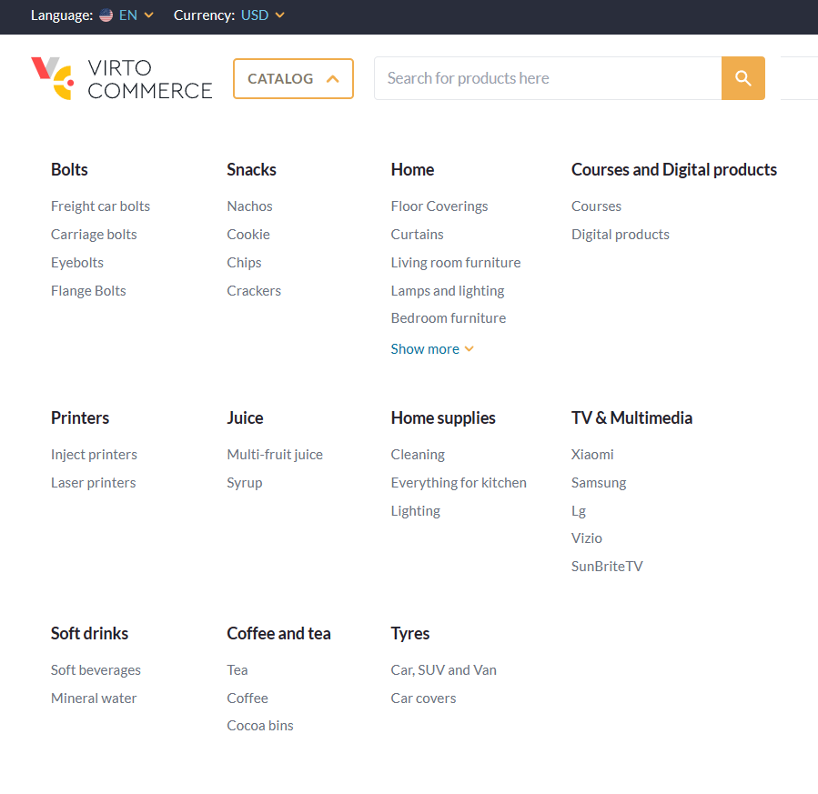
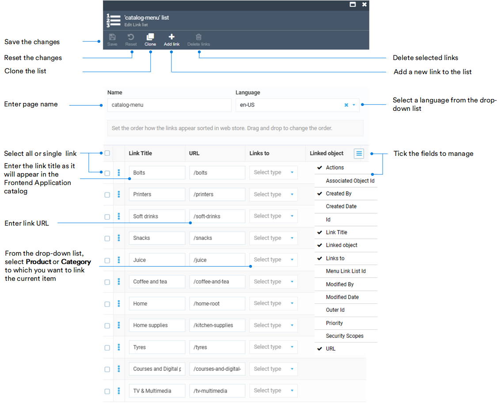
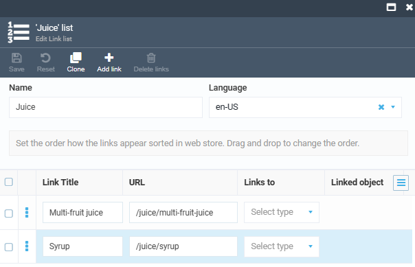

# Manage Link Lists

In the Virto Commerce Content module, link lists are collections of hyperlinks organized to facilitate efficient navigation through the catalog and provide quick access to its items. 

Click on the **Link lists** widget:

* To open the list of all the links in the catalog.
* To add new links.
* To delete links. 

Let's see how to create the catalog as in the [Virto Commerce Storefront demo version](https://virtostart-demo-store.govirto.com/). 

{: width="600"}

1. Click **Add** in the toolbar to add a new link list.
1. In our example, the list contains 11 links (Bolts, Printers, Soft Drinks, Snacks, etc). Fill in the fields as follows:

    

1. Click **Save** in the toolbar to save the changes.
1. Now let's fill in the **Juice** category with products. Click **Add** in the toolbar.
1. We want to add multi-fruit juice and syrup to the **Juice** category. Therefore, the URLs are **/juice/multi-fruit-juice** and **/juice/syrup**:

    

1. Click **Save** in the toolbar to save the changes.
1. Do the same for other categories.

Your catalog is now complete.