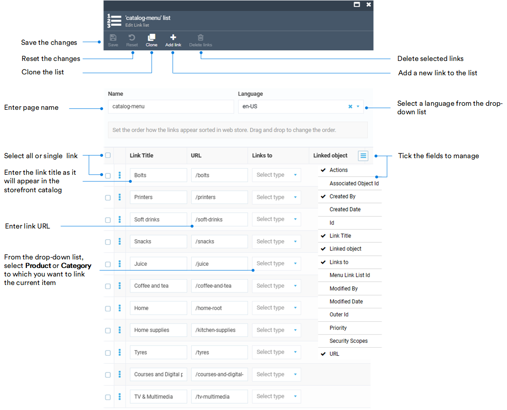

# Manage Link Lists

In the Virto Commerce Content module, link lists are collections of hyperlinks organized to facilitate efficient navigation through the catalog and provide quick access to its items via the mega menu or footer.

## Manage mega menu

On the frontend, the mega menu consists of two parts:

* A dropdown menu that is generated automatically based on catalog data. Users can access a category or its nested subcategories with just a few clicks.
* A horizontal bar that can either be configured using the link lists widget or generated automatically from catalog data. Users access a selected category with a single click. 

{: style="display: block; margin: 0 auto;" }

Let's create a horizontal bar of the mega menu from the above illustration: 

1. Click **Content** in the main menu.
1. In the next blade, select the required store, then click on the link lists widget.
1. In the next blade, click **Add** in the toolbar to add a new link list.
1. Let's add the existing catalog categories to the link list to be displayed in the mega menu:

    {: style="display: block; margin: 0 auto;" }

1. Click **Create** in the toolbar to save the changes.

    Your new link list appears in the link lists blade. Here, you can:

    * View all the available lists.
    * Add new lists.
    * Delete lists.

1. Now we need to add this link to the store settings so that the Frontend uses the newly created catalog-menu as the source for the mega menu's horizontal bar, instead of generating it automatically from catalog data. Click **Stores** in the main menu.
1. In the next blade, select your store.
1. In the next blade, click on the **Settings** widget.
1. In the **Settings** blade, find **Virto Commerce Frontend** segment and add **catalog-menu** as the top level catalog linked list.

    {: style="display: block; margin: 0 auto;" }

1. Click **OK**, then click **Save** in the previous blade to save the changes. 

Your newly configured menu appears on the frontend.

## Manage footer

Let's create the following footer:

{: style="display: block; margin: 0 auto;" }

1. Go to **Content** --> Your store --> **Link lists**.
1. In the **Link lists** blade, click **Add** in the toolbar.
1. To create root categories, fill in the fields as follows:

    {: style="display: block; margin: 0 auto;" }

    !!! note
        Name your footer link list **footer-links** so the Platform recognizes it as a part of the footer structure.

1. Click **Create**. The current result in the Frontend Application is as follows:

    {: style="display: block; margin: 0 auto;" }

1. Now let's add subcategories to the footer root categories. In the **Link lists** blade, click **Add** in the toolbar.
1. For the **My account** category, fill in the fields as follows:

    {: style="display: block; margin: 0 auto;" }

1. Click **Create**.

Continue adding subcategories to the root categories according to the example above.

The footer appears in the Frontend Application.

 
 
********

    <a href="../managing-pages">← Managing pages</a>
    <a href="../managing-blogs">Managing blogs →</a>

