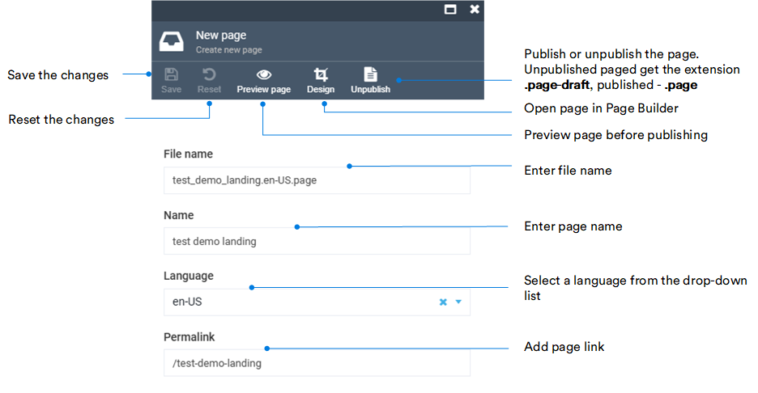

# Pages

Clicking on the **Pages** widget opens the list of the all pages your Storefront consists of. 

From the **Pages list**, you can:

* Add new pages.
* Upload new pages.
* Delete pages.
* Organize your pages into folders.
* Search pages by keyword. You can even search for pages containing images by their alternative text.

Click on the three dots to left of the page name to:

* Download it.
* Copy its link.
* Delete it.

{: width="450"}

## Create page

To create new pages:

* Use the upload feature (see image above).
* Use markdown or html by clicking **Html Page** in the blade below.

    !!! note
        If you have the Page Builder module installed, you can build pages from individual blocks by clicking **Design Page** in the blade below. <!-- ADD LINK TO PAGE BUILDER GUIDE -->

### Code-based creation

To create a new page using markdown or html, fill in the following fields in the **Markdown** tab: 

!!! info
    To manage page settings, switch to the Metadata tab. Click **Manage Metadata properties** to edit, add, or delete the settings.

    ??? Example
        

## Edit pages with .page and .page-draft extensions

!!! note
    This is an option for Page Builder users only.

In the **Pages list** blade, select the desired page and edit the following fields:

## Edit pages with .md extension

In the **Pages list** blade, select the desired page and edit it as markdown or html:

Click **Save** in the toolbar to save the changes.