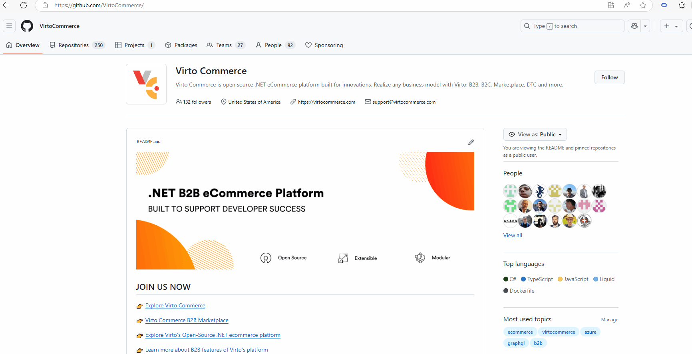

# Themes

The Virto Commerce Content module allows you to:

* Add as many themes as needed.
* Set an active theme to be displayed in the Frontend.

Managing theme includes:

* [Uploading new theme.](managing-themes.md#upload-new-theme)
* [Activating theme.](managing-themes.md#activate-theme)
* [Managing theme assets.](managing-themes.md#manage-theme-assets)
* [Adding new theme.](managing-themes.md#add-new-theme)

## Upload new theme

To upload a theme ZIP file:

1. Click **Content** in the main menu.
1. Select the store from the list in the next blade.
1. Click on the **Themes** widget.
1. In the **Themes list** blade, click **Upload** in the toolbar. 
1. Drag and drop or browse the ZIP file. 

Once the zip file has been uploaded, it will be unzipped and added to the Themes list.

If a new theme has been created by the developer, it can be uploaded to a new environment using a ZIP file.

You can use the themes designed by Virto Commerce. Each Frontend Application release contains a ZIP file with themes:

## Activate theme

To activate the theme:

1. Click **Content** in the main menu.
1. Select the store from the list in the next blade.
1. Click on the **Themes** widget.
1. In the **Themes list** blade, click the three dots to the left of the desired theme and click **Set active**.

The theme is now active.

## Manage theme assets

To manage the theme assets:

1. In the **Themes list**, select the desired store.
1. Click the three dots to the left of the folder to copy its link or delete it.
1. Click the three dots to the left of the file to copy its link, download, or delete it.

## Add new theme

To add a new theme:

1. Click **Content** in the main menu.
1. In the nest blade, select the store from the list.
1. Click on the **Themes** widget.
1. In the **Themes list** blade, click **Add** in the toolbar. 
1. Enter the name of the new theme. 
1. Click **Create** to create your new theme. 

The new theme appears in the themes list. Now it needs to filled in.

## Apply theme color scheme

Users can personalize their store by applying a [custom theme](/storefront/developer-guide/latest/customization/visual-theme-customization) or choosing from the ready-to-use color schemes designed by Virto Commerce. Each release includes a set of default color presets, with new ones added several times a year. To access the latest default color presets, users can simply download the updated theme. Currently, the following out-of-the-box color schemes can be applied to your store:

=== "purple-pink"

    

=== "black-gold"

    

=== "watermelon"

    

=== "coffee"

    

=== "ocean"

    

=== "peach"

    

{: width="25"} [Theme customization](/storefront/developer-guide/latest/customization/visual-theme-customization)

To apply a new color scheme to your store:

1. Select one of the out-of-the-box color schemes or your custom scheme and copy its name without extension to clipboard (for example, **watermelon**):
1. Go to **Stores** --> Your store --> **White labeling**.
1. In the **White labeling** blade, click {: width="25"} next to the **Theme preset name**.
1. In the next blade, click **Add** in the toolbar.
1. Paste the filename to the new field and click {: width="25"} to save the changes.
1. Click **Save** in the toolbar.
1. In the previous blade, select the newly added theme from the dropdown list. 
1. Click **Save** in the toolbar. 

Your new color scheme has been applied.

 
 
********

    <a href="../overview">← Content module overview</a>
    <a href="../managing-pages">Managing pages →</a>

