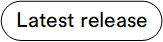

# Overview

The **Content** module is designed to manage and display content on your e-commerce site. 

The diagram below illustrates the relationships within the Virto Commerce Content Management System:

{: style="display: block; margin: 0 auto;" }

With the Content module, you can manage:

* [Themes.](managing-themes.md)
* [Pages.](managing-pages.md)
* [Link lists.](managing-linklists.md)
* [Blogs.](managing-blogs.md)

{: style="display: block; margin: 0 auto;" }

!!! note
    The Content module supports creating and editing pages using Markdown and HTML. Therefore, you may be interested in installing the [Page Builder module](../page-builder/overview.md) to create e-commerce pages from blocks and edit them using a visual editor. However, the Content module should be installed first.

You can access the Content module via:

=== "Main menu"

     

=== "Stores module"

    1. Click **Stores** in the main menu.
    1. In the **Stores** blade, select the store.
    1. In the **Store details** blade, click the **Themes** widget.

    

 
 
********

    <a href="../../assets/overview">← Assets module overview</a>
    <a href="../managing-themes">Managing themes →</a>

