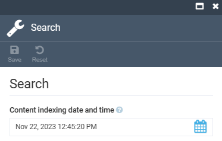

# Settings

To open the Content module settings:

1. Click **Settings** in the main menu.
1. In the search field of the next blade, type **Content** to find the settings related to the module.
1. Click **Search**.
1. Set date and time at which the content indexing task will start:

    

1. Click **Save** to save the changes.

The settings have been saved.