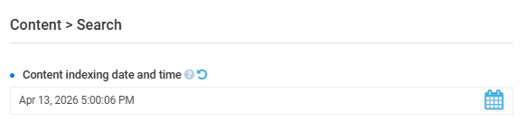

# Settings

To open the Content module settings:

1. Click **Settings** in the main menu.
1. In the search field of the next blade, type **Content** to find the settings related to the module.
1. Click **Search**.
1. Set date and time at which the content indexing task will start:

    {: style="display: block; margin: 0 auto;" }

1. Click **Save** in the toolbar to save the changes.

The modifications have been applied.

 
 
********

    <a href="../managing-blogs">← Managing blogs</a>
    <a href="../../integrations/builder-io/overview">Builder.io module overview →</a>

