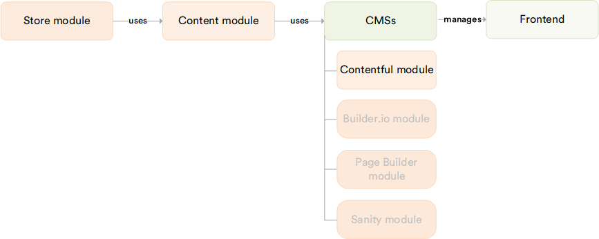

# Overview

The **Contentful** module integrates [Contentful](https://www.contentful.com/), a leading headless CMS, with the Virto Commerce Platform. It allows your marketing and content teams to author, manage, and publish rich ecommerce content in Contentful. It automatically syncs that content to your Virto Commerce Frontend. Unlike the Content module, which manages pages and assets directly within the Virto Commerce Platform, the Contentful module connects to an external, best-in-class content authoring environment and delivers its content through Virto Commerce.

The [Pages module](../pages/overview.md) must be installed before using the Contentful module, as it provides the underlying page storage and delivery infrastructure.

## Key features

The diagram below illustrates the relationships within the Virto Commerce Content Management System:

{: style="display: block; margin: 0 auto;" }

With the Contentful module, you can:

* Author and publish CMS pages, banners, and editorial content in Contentful that automatically appear on your Virto Commerce Frontend.
* Receive real-time page updates through webhooks whenever entries are created, updated, or deleted in Contentful.
* Run full index rebuilds and scheduled synchronization to keep Virto Commerce aligned with Contentful at any time.
* Preview draft content alongside published entries using the Contentful Preview API.
* Create and modify products with names, properties, and editorial reviews directly from Contentful.
* Deliver consistent content across web, mobile, and other digital touchpoints from a single source.

{: width="25"} [Contentful module setup](/platform/developer-guide/latest/Extensibility/cms-integrations/contentful-setup)

 
 
********

    <a href="../../sanity/overview">← Sanity module overview</a>
    <a href="../../ai-doc-processing/overview">AI Smart Capture module overview →</a>

