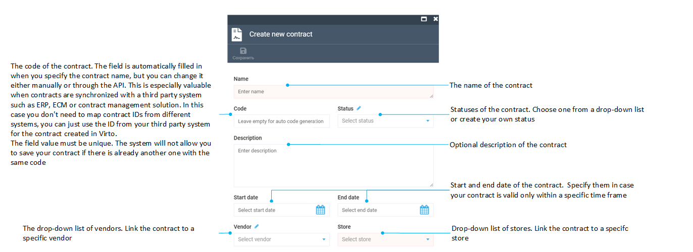
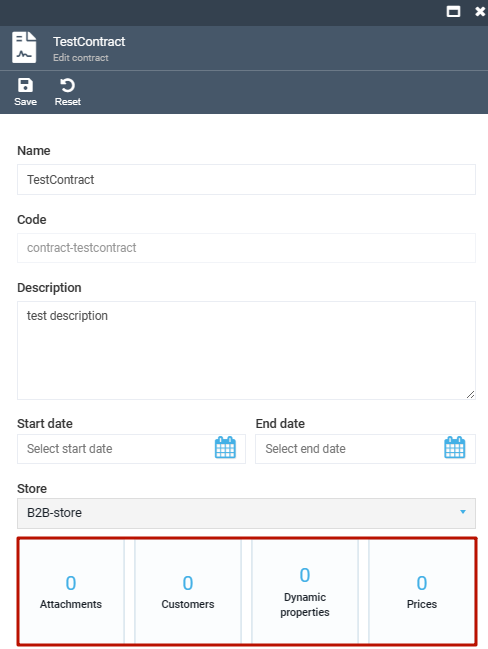
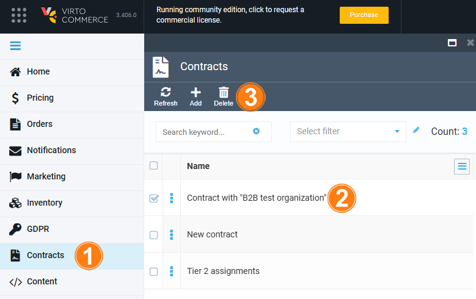

# Manage Contracts

Managing contracts includes:

* [Creating a new contract.](creating-and-terminating-contracts.md#create-new-contract)
* [Deleting an existing contract.](creating-and-terminating-contracts.md#delete-contract)

## Create new contract

To create a new contract:

1. Click **Contracts** in the main menu. 

1. In the new blade, click **Add** in the toolbar to open the **Create new contract** blade:

	{: style="display: block; margin: 0 auto;" }

1. Fill in the fields and click **Save** in the toolbar.

After the contract is created, new widgets become available:

{: style="display: block; margin: 0 auto;" }

Use these widgets to manage:

* [Contract prices](managing-contract-prices.md)
* [Customers](managing-contract-customers.md)
* Other related information

## Delete contract

!!! warning
	After your contract is deleted, you will have no options to restore it. Make sure to double-check everything before you proceed to termination.

To delete a contract:

1. Click **Contracts** in the main menu to open the list of contracts. 

1. Check one or more contracts.

1. Click **Delete** in the toolbar.

	{: style="display: block; margin: 0 auto;" width="550"}

1. Confirm the deletion.

The contract has been deleted.

 
 
********

    <a href="../overview">← Contracts module overview</a>
    <a href="../managing-contract-prices">Managing contract prices →</a>

