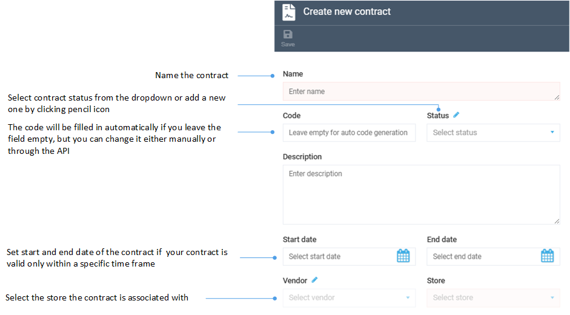
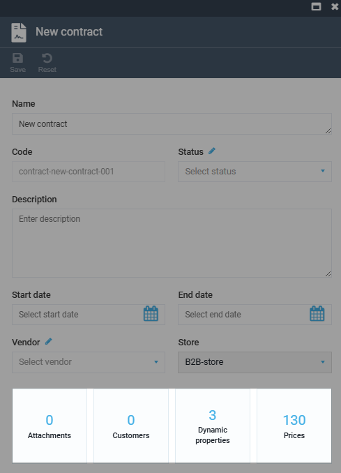

# Create Contract

To create a new contract:

1. Click **Contracts** in the main menu. 

1. In the new blade, click **Add** in the toolbar to open the **Create new contract** blade:

	{: style="display: block; margin: 0 auto;" }

1. Fill in the fields and click **Save** in the toolbar.

After the contract is created, new widgets become available:

{: style="display: block; margin: 0 auto;" }

Use these widgets to manage:

* [Contract prices.](managing-contract-prices.md)
* [Customers.](managing-contract-customers.md)
* Other related information.

 
 
********

    <a href="../overview">← Contracts module overview</a>
    <a href="../managing-contract-prices">Managing contract prices →</a>

