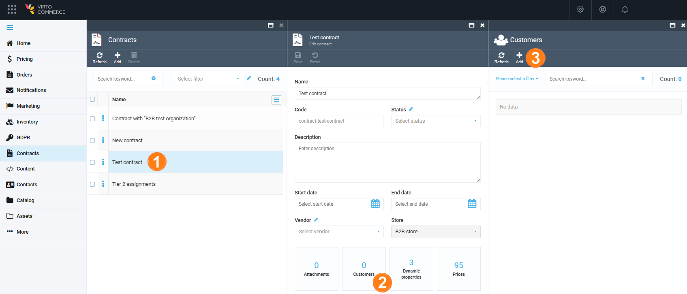
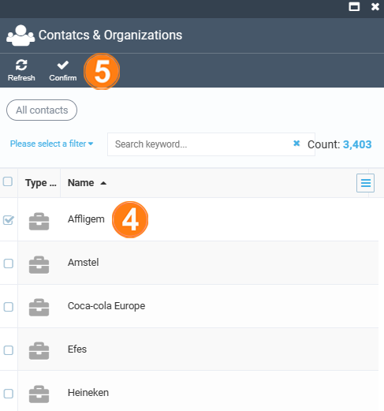
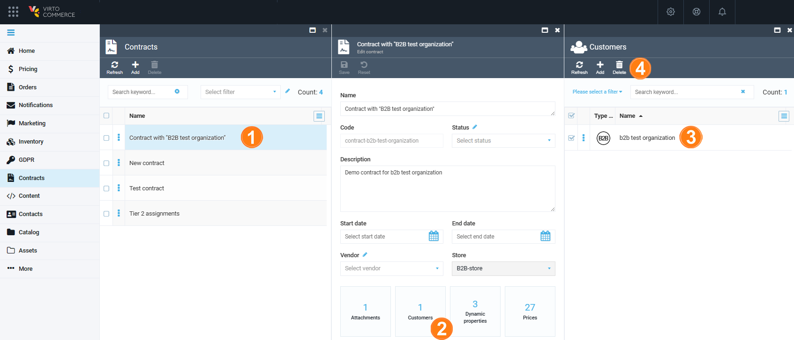

# Manage Contract Customers

Managing contract customers includes:

* [Adding companies to the contract.](managing-contract-customers.md#add-companies-to-contract)
* [Removing companies from the contract.](managing-contract-customers.md#remove-companies-from-contract)

## Add companies to contract

To manage the list of customers linked to the contract (get prices based on this contract):

1. Select the contract in the **Contracts** blade.

1. In the next blade, click the **Customers** widget.

1. In the next blade, click **Add** to open the list of contacts and organizations.

    {: style="display: block; margin: 0 auto;" }

1. Check the companies you need to add to your contract. 

1. Click **Confirm** in the toolbar.

    {: style="display: block; margin: 0 auto;" width="350"}

The specified companies have now been added to the contract. This also adds all child companies and related contacts, so it is not necessary to add each user individually.

## Remove companies from contract

To remove a company from your contract:

1. Select the contract in the **Contracts** blade.

1. In the next blade, click the **Customers** widget.

1. Check one or more companies that you want to remove. 

1. Click **Delete** in the top toolbar.

    {: style="display: block; margin: 0 auto;" }

1. Confirm your action.

The company has been removed.

 
 
********

    <a href="../managing-contract-prices">← Managing contract prices</a>
    <a href="../../customer-export-import/overview">Customer Export and Import module overview→</a>

