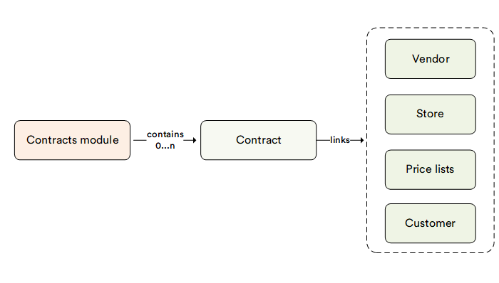

# Overview

The **Contracts** module allows you to create and manage customer contracts. Each contract defines the prices the customer receives during the contract period. The feature is designed with B2B companies in mind.

The Contracts feature is based on the Virto Commerce native personalization engine to provide a convenient experience for users managing B2B customer personalization.

The diagram below illustrates the interconnections among various key entities within the Contracts module:

{: style="display: block; margin: 0 auto;" }

By creating a contract, you link the buyer's company or contact with the price list that will apply to the company during the contract period in the selected store.

To simplify the user experience for those managing contracts, there is an option to select an existing price list as the `_default_` for the contract and then update specific prices within it. This allows you to create large custom price lists with minimal effort.

You can also use the same contract for multiple organizations, which is especially valuable for companies that sell goods or services to companies with complicated organizational structures.

## Key features

With the Contracts module, you can:

* [Manage contracts.](creating-and-terminating-contracts.md)
* [Manage contract prices.](managing-contract-prices.md)
* [Manage contract customers.](managing-contract-customers.md)

## Understanding how contracts work

Since the contract is built on top of existing Virto capabilities such as pricing, personalization, and customer management, it is worth explaining how it works.
in terms of existing Virto objects. Once you create a contract, the system will automatically:

* Create a new user group equal to the unique contract code.

* Assign the created user group to the companies included in the contract.

* Create a new price list assignment that links the default price list to the new user group (equal to the contract code).

* Create a new price list with all registered contract custom price updates.

* Create a new price list association that links the new price list to the new user group (equal to the contract code).
    
All these changes can be recorded to the appropriate entities (companies, price lists and price list assignments) if required, while the user who manages contracts can easily work with the module without being aware of all these details.

 
 
********

    <a href="../../catalog-personalization/overview">← Catalog-related modules overview</a>
    <a href="../creating-and-terminating-contracts">Managing contracts →</a>

