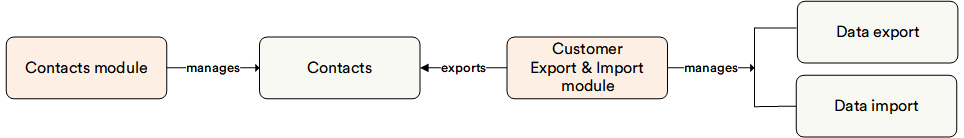

# Overview

The **Customer Export and Import** module facilitates the seamless transfer of significant data between the Virto Commerce Contacts module and another system. This is achieved by using a specially formatted spreadsheet to import or export the desired data. Virto Commerce relies on CSV (comma-separated value) files for efficient bulk tasks like this.

The primary goal of this module is to empower non-technical users, such as customer managers. These individuals, who regularly interact with customers and may not understand the intricacies of database structures, can now effortlessly navigate customer export and import functions. This ensures a convenient and efficient customer data management experience.

With the Customer Export and Import Module, you can:

* Export contacts and organizations for editing and updating.
* Migrate contacts and organizations from another system.
* Migrate accounts from another system.

## Key Features

The diagram below illustrates the functionality of the **Customer Export and Import** module:

