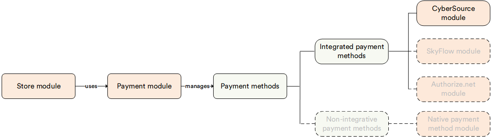

# Overview

The **CyberSource** module integrates CyberSource payment solutions with your Virto Commerce platform.

It enables secure and seamless payment processing, using CyberSource's Flex Microform technology for enhanced user experience and PCI compliance. This module is designed for businesses seeking to integrate a robust and scalable payment gateway into their ecommerce platform.

## Key features

The diagram below illustrates the dependencies of the CyberSource module:

{: style="display: block; margin: 0 auto;" }

 
 
********

    <a href="../../native-payment-methods/overview">← Native Payment Methods module overview</a>
    <a href="../manage-cybersource">Managing CyberSource →</a>

