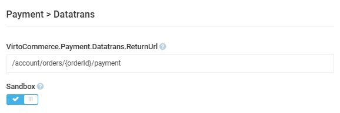

# Settings

To manage personalization settings:

1. Click **Settings** in the main menu.
1. In the next blade, type **Payment**, then select **Datatrans**.
1. In the next blade, configure the settings:

    {: style="display: block; margin: 0 auto;" }

1. Click **Save** in the toolbar to save the changes.

The settings have been saved.

 
 
********

    <a href="../manage-datatrans">← Managing Datatrans</a>
    <a href="../../skyflow/overview">Skyflow module overview →</a>

