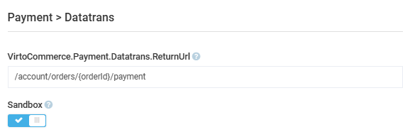
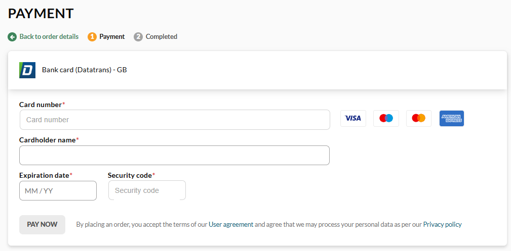
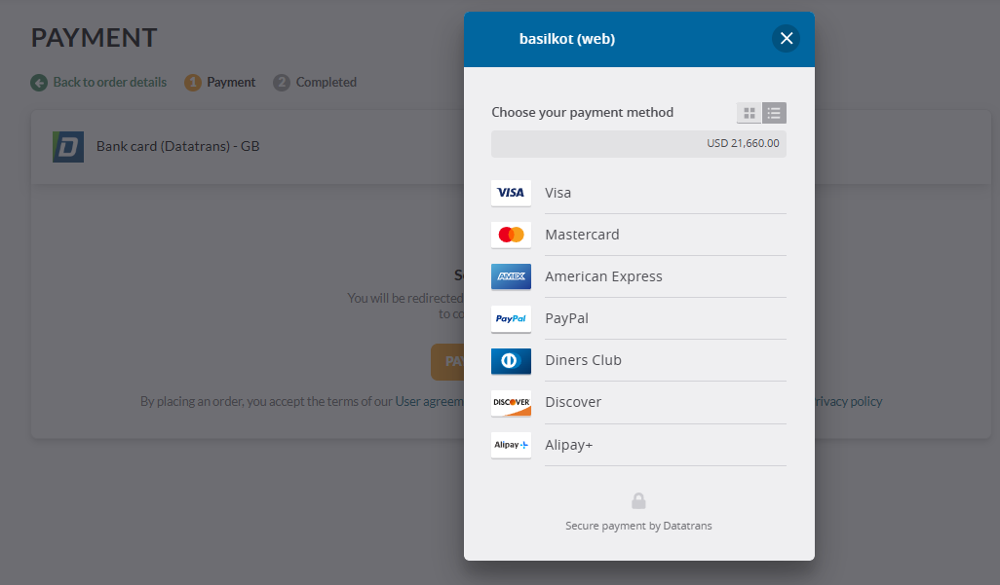

# Settings

To configure the module's settings:

1. Click **Stores** in the main menu. 
1. In the next blade, select your store.
1. In the next blade, click on the **Payment methods** widget.
1. In the next blade, select **Datatrans**.
1. In the next blade, click on the **Settings** widget:
1. In the next blade, configure the following settings:

    {: style="display: block; margin: 0 auto;" }

1. Click **OK**, then **Save** to save the changes.

You modifications have been applied.

On the Frontend, the selected mode is displayed as follows:

-   __Inline mode__

    ---

    

-   __Popup mode__

    ---

    

 
 
********

    <a href="../manage-datatrans">← Managing Datatrans</a>
    <a href="../../skyflow/overview">Skyflow module overview →</a>

