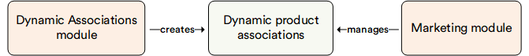

# Overview

This module facilitates sales growth and marketing cost reduction through its upselling and cross-selling functionalities.

You can easily establish product relationships to showcase to customers by setting up product association rules. These rules are dynamic, meaning they are defined by a set of criteria rather than individual products. Thus, any new product meeting the rule conditions automatically adheres to the rule without necessitating modifications.

The evaluation mechanism retrieves associated products by prioritizing the most relevant rule matched to the provided products.

## Key features

With the Dynamic Associations module, you can:

* Create product associations using dynamic conditions.
* Use extendable evaluation mechanisms.

The diagram below illustrates the function of the Dynamic Associations module:

{: width="25"} [Managing Dynamic Associations](../marketing/managing-dynamic-associations.md)

 
 
********

    <a href="../../customer-export-import/overview">← Customer Export and Import module overview</a>
    <a href="../../event-bus/overview">Event Bus module overview →</a>

