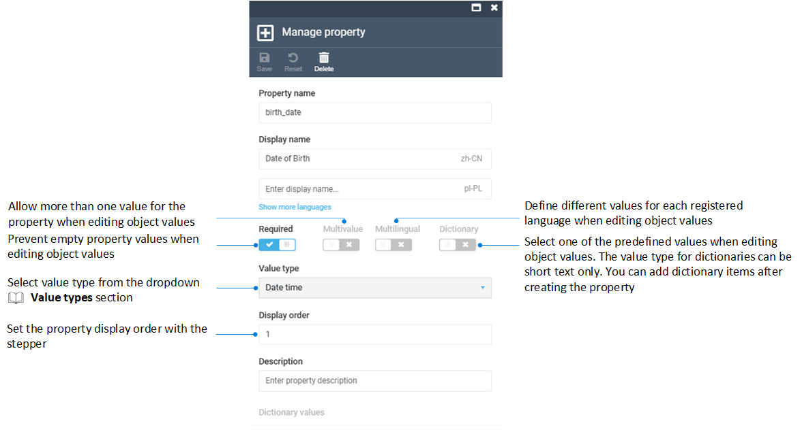
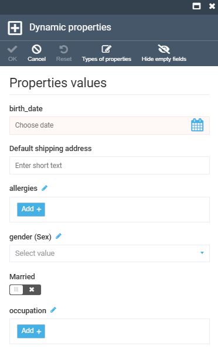
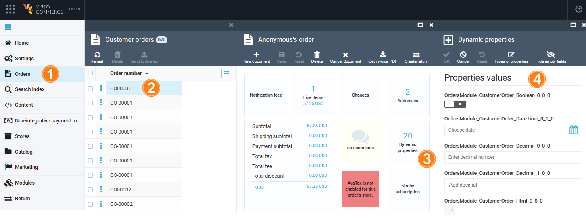

# Manage Dynamic Properties

Dynamic properties extend almost any entity in the Platform at runtime, including Orders, Carts, Quotes, Customers, Companies, Shipments, and Payments. They are configured in the dedicated **Dynamic properties** section of the main menu, where you first pick the object type and then add the property to it.

## Add a dynamic property

To add a new dynamic property:

1. Open Platform and click **Dynamic properties** in the main menu.
1. In the next blade, select the desired object type.
1. In the next blade, click **Add new property** in the toolbar.
1. Fill in the property name, value type, and display order, then enable the relevant switches. For example, this is how to add a birth date to a contact:

    

1. Click **Create** to save the changes.

A new dynamic property has been added. From now on, when adding a contact, the user sees this field to fill in:

{: style="display: block; margin: 0 auto;" }

{: width="20"} [Value types](/platform/user-guide/dynamic-properties/managing-dynamic-properties/)

## Edit dynamic property values

Dynamic property values are edited through the **Dynamic properties** widget. For example, to edit the dynamic properties of a specific order:

1. Open Platform and click **Orders** in the main menu.
1. In the next blade, select the desired order.
1. In the next blade, click the **Dynamic properties** widget.
1. In the next blade, edit the available properties:

    

1. Click **OK** in the toolbar to save the changes.

The modifications have been saved.

 
 
********

    <a href="../../dynamic-associations/overview">← Dynamic Associations module overview</a>
    <a href="../../environments-comparison/overview">Environments Comparison module overview →</a>
