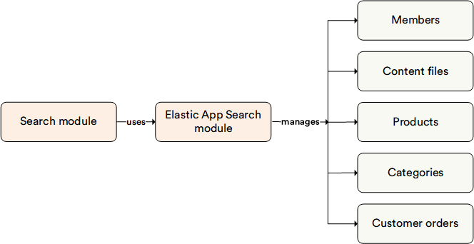

# Overview

The **Elastic App Search** module provides search, aggregation, and analytic capabilities as a service, on top of ElasticSearch. It also supplies tools that can help you tune search result sets without development:

* [Relevance tuning.](https://www.elastic.co/guide/en/app-search/current/precision-tuning.html)
* [Synonyms.](https://www.elastic.co/guide/en/app-search/current/synonyms-guide.html)
* [Curations.](https://www.elastic.co/guide/en/app-search/current/curations-guide.html)

It supports extended no-code scenarios and category manager settings to enhance search functionality.

{: width="25"} [Deploying Elastic App Search](https://www.elastic.co/guide/en/app-search/current/installation.html)

## Key features

The Elastic App Search module offers:

* Full-text search provider compatibility with Elastic App Search version 8.12 and higher.
* Boosting profile functionality.
* Dynamic boosting concatenation, combining dynamic boosting with query and static boosting from the Search Relevance Tuning panel.

The diagram below illustrates the functionality of the Elastic App Search module:

{: style="display: block; margin: 0 auto;" }

{: width="25"} [Configuring Elastic App Search Provider](../../../developer-guide/Configuration-Reference/appsettingsjson)

{: width="25"} [Elastic App Search Documentation](https://www.elastic.co/guide/en/app-search/current/getting-started.html)

{: width="25"} [Elastic App Search Boosting](https://www.elastic.co/guide/en/app-search/current/boosts.html)

 
 
********

    <a href="../../elastic-search-8/overview">← Elasticsearch 8 module overview</a>
    <a href="../../elastic-search/overview">Elasticsearch module overview →</a>

