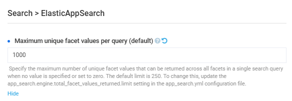

# Settings

To open the **Elastic App Search** module settings:

1. Click **Settings** in the main menu.
1. In the search field of the next blade, type **Search** to find the settings related to search modules.
1. Select **Elastic App Search** from the list. 
1. In the next blade, configure the following settings:

    {: style="display: block; margin: 0 auto;" }

1. Click **Save** in the top toolbar to save the changes.

The settings have been saved.

 
 
********

    <a href="../search-relevance-tuning">← Tuning search relevance</a>
    <a href="../../elastic-search/overview">Elasticsearch module overview →</a>

