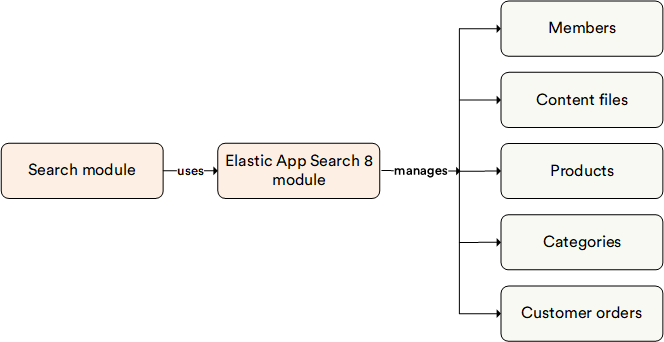

# Elastic Search 8

The Virto Commerce **Elastic Search 8** module serves as a search engine for the Search module. It is the most commonly used search engine among Virto Commerce users.

## Key Features

With the Elastic Search 8 module, you can performm:

* Full-text search with new .NET client for Elasticsearch.
* [Semantic search](../../../developer-guide/docs/Fundamentals/Indexed-Search/integration/semantic-search.md).
* Hybrid mode search.
* Third party ML models support.

The diagram below illustrates the functionality of the Elastic Search 8 module:

