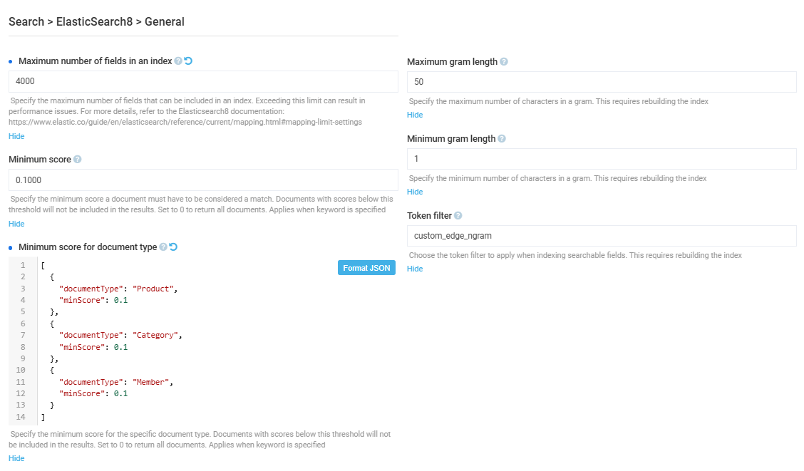
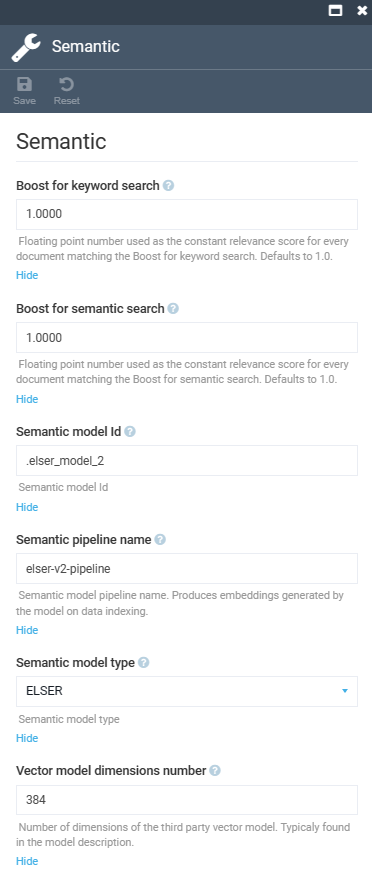

# Settings

To open the **Elastic Search 8** module settings:

1. Click **Settings** in the main menu.
1. In the search field of the next blade, type **ElasticSearch8** to find the settings related to the module.
1. Click **General** to configure the following settings in the next blade:

    

1. Click **Semantic** to configure the following settings in the next blade:

    

1. Click **Save** in the top toolbar to save the changes.

The settings have been saved.
