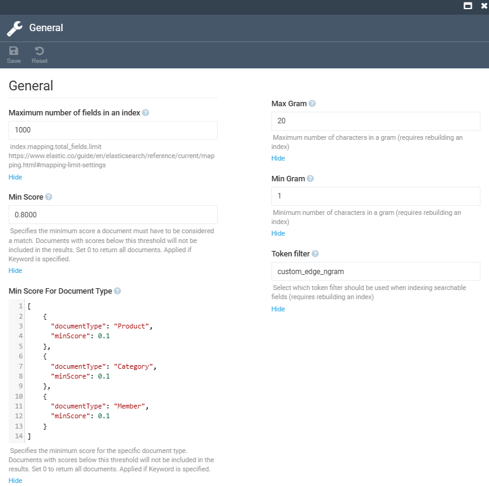

# Settings

To open the **Elasticsearch 8** module settings:

1. Click **Settings** in the main menu.
1. In the search field of the next blade, type **Elasticsearch8** to find the settings related to the module.
1. Click **General** to configure the following settings in the next blade:

    {: style="display: block; margin: 0 auto;" }

1. Click **Semantic** to configure the following settings in the next blade:

    {: style="display: block; margin: 0 auto;" }

1. Click **Save** in the top toolbar to save the changes.

The settings have been saved.

 
 
********

    <a href="../overview">← Elasticsearch 8 module overview</a>
    <a href="../../elastic-app-search/overview">Elastic App Search module overview →</a>

