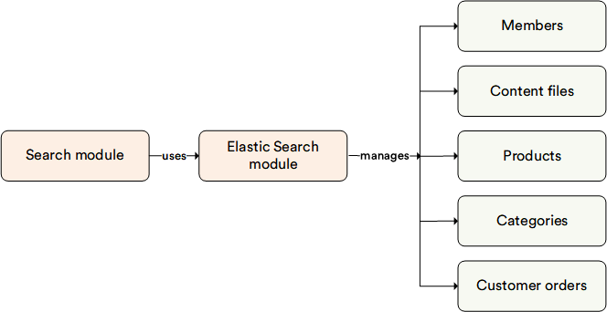

# Overview

The **Elastic Search** module serves as a search engine for the Search module. It leverages the Elasticsearch and OpenSearch engines to store indexed documents.

The module supports the following Elasticsearch deployment options:

* Standalone [Elasticsearch](https://www.elastic.co/products/elasticsearch)
* [Elastic Cloud](https://cloud.elastic.co/)
* [OpenSearch](https://opensearch.org/)
* [Amazon OpenSearch Service](https://aws.amazon.com/opensearch-service/)

## Key features

The diagram below illustrates the functionality of the Elastic Search module:

{: width="25"} [Blue-Green Indexing](../search/managing-search.md#blue-green-indexing)