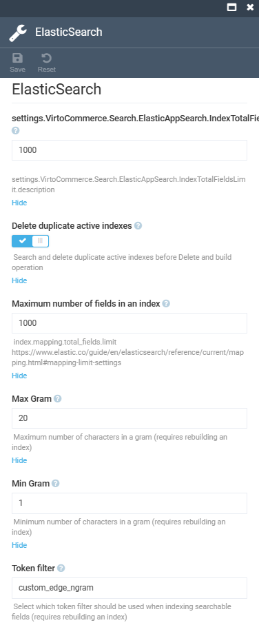

# Settings

To open the **Elastic Search** module settings:

1. Click **Settings** in the main menu.
1. In the search field of the next blade, type **Search** to find the settings related to search modules.
1. Select **Elastic Search** from the list. 
1. In the next blade, configure the following settings:

    

1. Click **Save** in the top toolbar to save the changes.

The settings have been saved.
