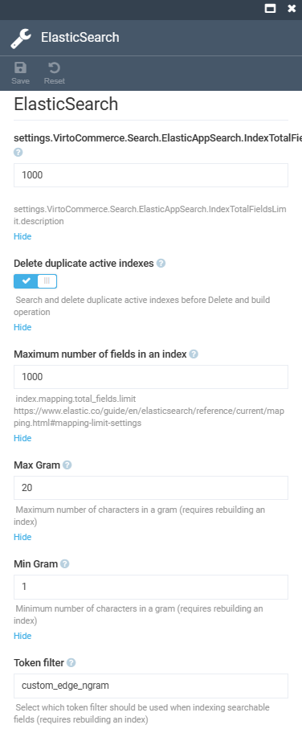

# Settings

To open the **Elasticsearch** module settings:

1. Click **Settings** in the main menu.
1. In the search field of the next blade, type **Search** to find the settings related to search modules.
1. Select **Elasticsearch** from the list. 
1. In the next blade, configure the following settings:

    {: style="display: block; margin: 0 auto;" }

1. Click **Save** in the toolbar to save the changes.

Your modifications have been applied.

 
 
********

    <a href="../overview">← Elasticsearch module overview</a>
    <a href="../../azure-search/overview">Azure Search module overview →</a>

