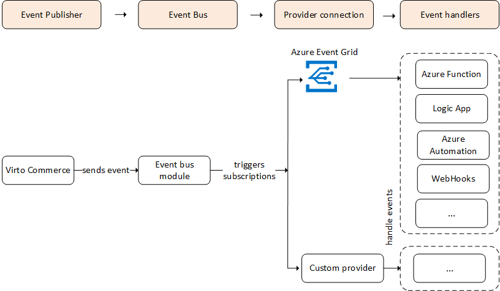

# Overview

The **Event Bus** module allows you to be notified of new Virto Commerce events or changes via the message queue of your choice. It triggers asynchronous background processes in response to the Platform events, delivering predefined messages or resource changes as payloads. This facilitates event-driven reactive programming using a publish-subscribe model, where publishers emit events without expectations, and subscribers choose which events to handle.

The event description is based on the **CloudEvents** specification, which provides a standardized way to describe event data.

## Key features

The **Event Bus** module provides:

* Notification on new events from any module.
* Support for multiple destination providers.
* Custom destination provider support (contact us for new destinations).
* Configurability via API and application configuration (**appsettings.json**, environment variables, etc.).
* Additional event filtering with JsonPath expressions.
* Preprocessing event data with Liquid templates for fine-tuning payload for destination providers.
* High performance.
* Predefined destination provider: [Azure Event Grid](https://azure.microsoft.com/en-us/services/event-grid) with CloudEvents-based data format.

The diagram below illustrates the functionality of the Event Bus module:

{: style="display: block; margin: 0 auto;" width="750"}

## Example uses for Event Bus

* **Serverless application architectures:** Use Azure Event Grid to trigger serverless functions instantly for tasks like currency exchange when a new price is added to a price list.

* **Approval process automation:** Utilize Azure Event Grid to notify Azure Automation of new orders or customer registrations, streamlining approval processes by automatically checking configurations, updating metadata, changing statuses, or sending email notifications.

* **Application integration:** Connect your app to other services by sending Virto Commerce event data to Event Grid, leveraging its reliable delivery, advanced routing, and seamless integration with Azure. Alternatively, integrate Event Grid with Logic Apps for code-free data processing across diverse environments.

 
 
********

    <a href="../../environments-comparison/overview">← Environments Comparison module overview</a>
    <a href="../../x-frontend/overview">xFrontend module overview →</a>

