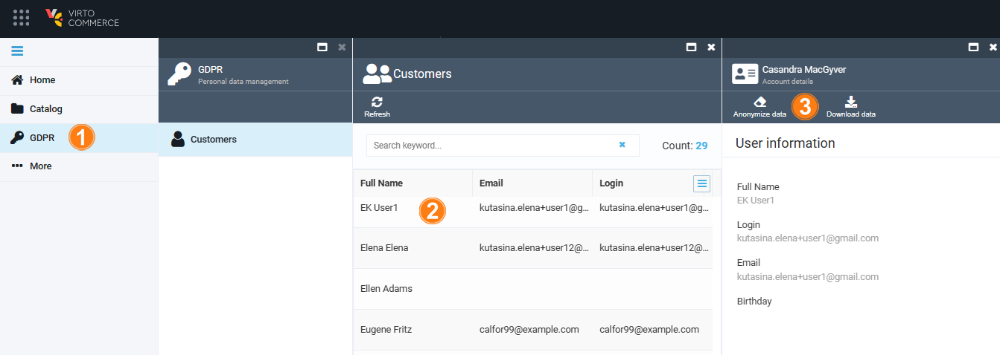
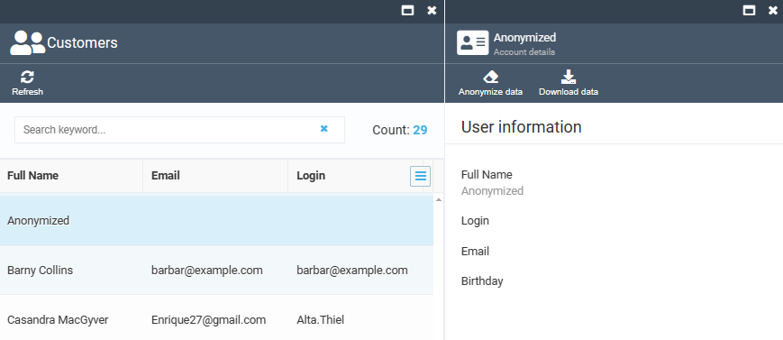

# Manage GDPR 

Managing GDPR includes:

* [Anonymizing personal data.](manage-personal-data.md#anonymize-personal-data)
* [Downloading personal data.](manage-personal-data.md#download-personal-data)

## Anonymize personal data

To anonymize personal data according to the customer's request:

1. Click **GDPR** in the main menu.
1. The next blades display personal data of your customers. Click on the required contact. 
1. The next blade displays available contact details. Click **Anonymize data** in the top toolbar to anonymize them.

	

1. Confirm your action.

The personal data have been anonymized to comply with the customer's request in accordance with the GDPR:



!!! note 
	While the customer's login and email will appear as a GUID once anonymized, their address and other personal data will only appear as **Anonymized**. This is because both login and email must still have valid values to store order data, even after anonymization.

## Download personal data

To download the personal data for demonstration to the customer:

1. Complete the steps 1-2 from the instruction above.
1. In the next blade, click **Download data** in the top toolbar.

The personal data have been downloaded as a JSON file. 

<details><summary>Downloaded Customer Details in JSON Format</summary>

```
{
	"firstName": "Alex",
	"lastName": "Starberg",
	"fullName": "Alex Starberg",
	"birthday": "1982-02-09T21:00:00Z",
	"emailAddresses": [],
	"phones": [],
	"addresses": [],
	"accounts": [
		{
			"login": "Login",
			"emailAddress": "123@test.com"
		},
		{
			"login": "bomba89@example.com",
			"emailAddress": "bomba89@example.com"
		}
	],
	"orders": [
		{
			"addresses": [
				{
					"firstName": "Alex",
					"lastName": "Starberg",
					"country": "United States",
					"region": "Tennessee",
					"city": "Chattanooga",
					"line1": "475 Uptain Rd.",
					"email": "bomba89@example.com",
					"phone": "(423) 978-0927"
				}
			]
		},
		{
			"addresses": [
				{
					"firstName": "Alex",
					"lastName": "Starberg",
					"country": "United States",
					"region": "Tennessee",
					"city": "Chattanooga",
					"line1": "475 Uptain Rd.",
					"email": "bomba89@example.com",
					"phone": "(423) 978-0927"
				}
			]
		}
	]
}
```
</details>

!!! tip
	You can convert the JSON file into TXT or CSV before sending it to your customer.

