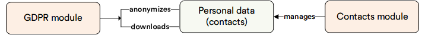

# Overview

The [General Data Protection Regulation](https://gdpr-info.eu/), or GDPR, is a regulation in the EU law that, basically, provides a right to a private individual residing in the EU to request their personal details stored with a third party at any time and, if applicable, to have them deleted from any third party website.

Our **GDPR** module is a tool allowing you to supply the customer with or remove their personal details, by anonymizing them, from your online store. It is perfectly in line with the General Data Protection Regulation that enables every individual to request their personal data stored on a website or demand to remove such at any time.

## Key features

The diagram below illustrates the functionality of the GDPR module:

 
 
********

    <a href="../../event-bus/overview">← Event Bus module overview</a>
    <a href="../manage-personal-data">Managing personal data →</a>

