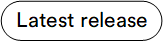
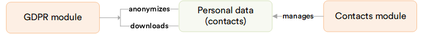

# Overview

The [General Data Protection Regulation](https://gdpr-info.eu/), or GDPR, is a regulation in the EU law that, basically, provides a right to a private individual residing in the EU to request their personal details stored with a third party at any time and, if applicable, to have them deleted from any third party website.

Our **GDPR** module is a tool allowing you to supply the customer with or remove their personal details, by anonymizing them, from your online store. It is perfectly in line with the General Data Protection Regulation that enables every individual to request their personal data stored on a website or demand to remove such at any time.

The module acts on request: it anonymizes or exports a customer's data when triggered from the admin UI. It does not enforce automatic data-retention periods, for example, a TTL on order history or audit logs. Configure retention for those separately.

The module is named and framed around GDPR, but anonymizing a customer's personal data on request is the same mechanism other regulations ask for under different names, for example, the CCPA right to delete. Virto Commerce does not publish a CCPA-specific statement or use that terminology in the product. The module also does not address data residency (which region a deployment's database and backups physically live in), which is determined by where you deploy the Platform, not by this module.

## Key features

The diagram below illustrates the functionality of the GDPR module:

{: style="display: block; margin: 0 auto;" }

 
 
********

    <a href="../../x-Frontend/overview">← xFrontend module overview</a>
    <a href="../manage-personal-data">Managing personal data →</a>

