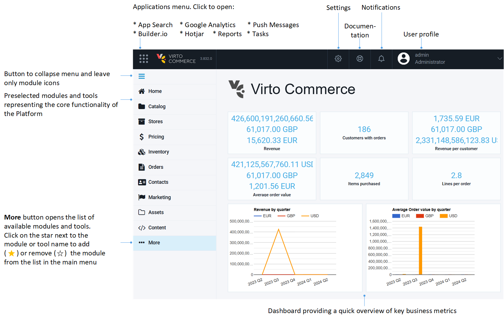
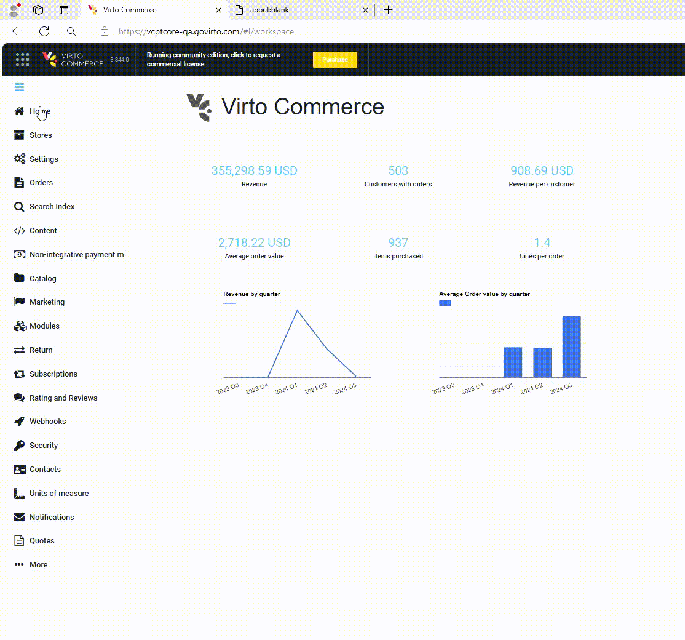
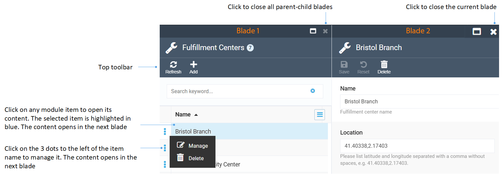
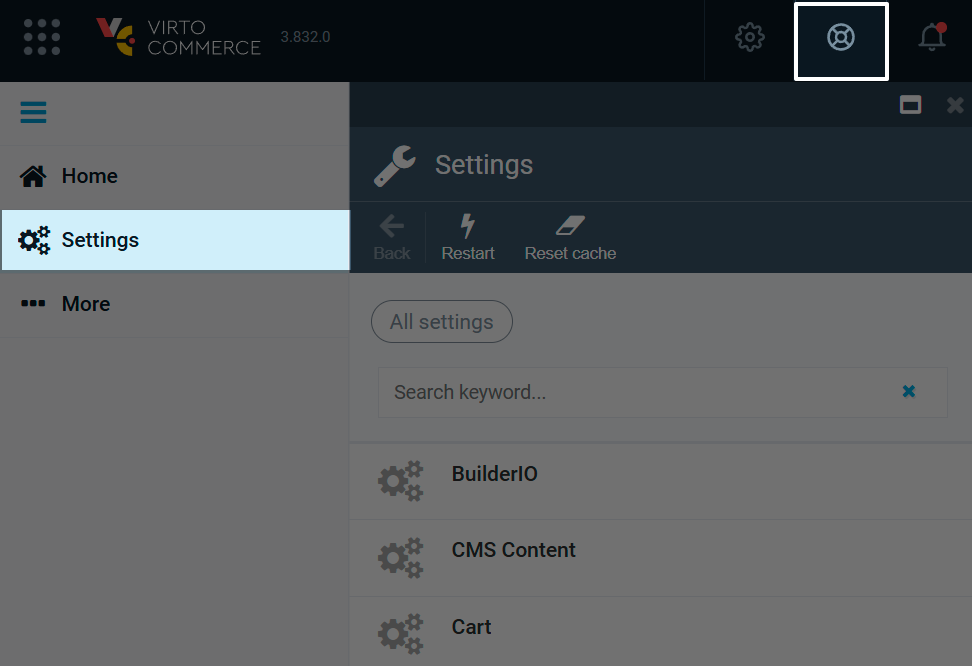
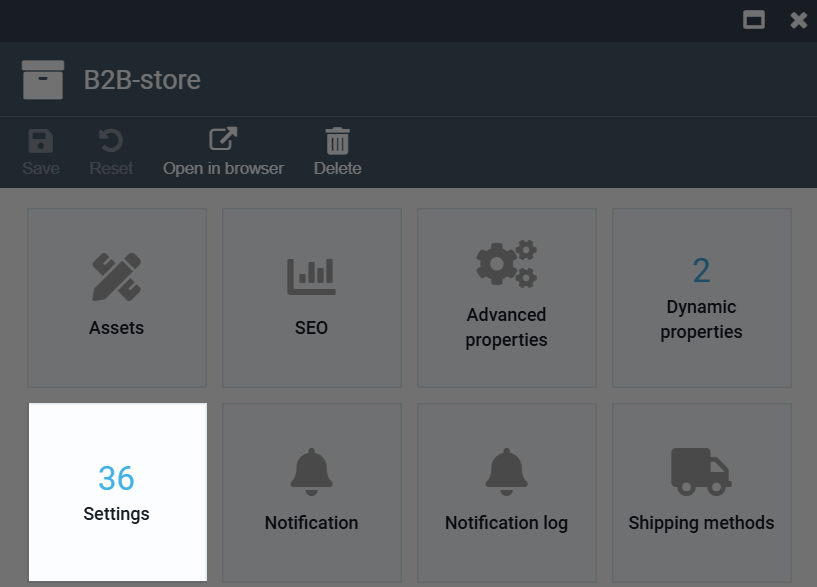

# General Guidelines

Although the Platform interface is user friendly and intuitive, read this article to understand general techniques of working with the Platform. 

## Home page

The Platform's home page shows:

* **Dashboard**: Provides insights into sales performance, customer behavior, and overall business health.
* **Main menu**: Lists some of the available modules. You can adjust the number of items in the menu to suit your needs. Click **More** in the main menu to view the complete list of available modules.
* **Applications menu button**: Opens a list of tools and integrations to enhance various aspects of ecommerce operations.
* **Links to documentation**.
* **Modules Settings Button**.
* [User profile link](user-profile.md). 

## Multilingual SEO URLs

This feature allows each localized page in the Virto Commerce Frontend to have a language-specific URL that improves both search engine optimization and user experience.

When a customer visits a multilingual Frontend, URLs automatically adapt to the selected language or region, ensuring that:

* Search engines index the correct localized version of each page.
* Customers land on the appropriate language version when browsing or sharing links.
* Switching languages in the Frontend does not disrupt navigation or cause broken links.

The feature is available only for multi-language Frontend configurations.

| Configuration type    | Example URL     | Description                                                                          |
| --------------------- | ----------------| ------------------------------------------------------------------------------------ |
| Default language  | `/about-us`         | Used for the default Frontend language when no language code is specified.           |
| Language-specific | `/{xx}/about-us`    | Includes a two-letter language code, e.g., `/en/about-us`.                           |
| Region-specific   | `/{xx-XX}/about-us` | Includes both language and region codes, e.g., `/en-US/about-us`, `/en-GB/about-us`. |

When a customer changes the language in the Frontend, the permalink is updated in the browser to include the selected culture code (for example, **/en/about-us** --> **/de/über-uns**). The selected language is saved in local storage and automatically applied as the default language for future visits.

### Items URLs

When you open the desired order, product, or product category, you can copy its URL and paste it into a new window to open the desired item immediately:

## Blades

The Virto Commerce Platform's UI is organized and divided into multiple screens called blades. Blades are ordered left to right and share parent-child hierarchy. Any parent blade has one or more child blades, while every child has a reference to its parent. The hierarchy depth is unlimited. 

To access a module, click on it in the main menu. Its content will appear in the next blade. Manage the module's content using the buttons in the top toolbar or by clicking the three dots next to the item's name:

## Settings

There are several options to open a module's settings in the Platform:

=== "**Settings** in the main menu"

    {: style="display: block; margin: 0 auto;" }

=== "**Settings** button in the toolbar"

    {: style="display: block; margin: 0 auto;" }

=== "**Settings** widget inside the specific module"

    {: style="display: block; margin: 0 auto;" }

In the **Settings** toolbar, you can:

* Restart the application to apply new settings.
* Clear all cached data.

{: style="display: block; margin: 0 auto;" }

## Developer tools

This section gives developers access to useful diagnostics and integration tools:

* **Health**: Shows the health status of the Virto Commerce Platform and its dependencies (e.g., database, search engine, blob storage).
* **Hangfire**: Provides a dashboard for managing and monitoring background jobs.
* **Swagger**: Interactive API documentation for the Virto Commerce Platform.
* **GraphQL**: An IDE for exploring and executing GraphQL queries against the platform.

The **Developer tools** blade is available to users with the **platform:developer-tools:access** permission. Access to **Hangfire** also requires the same permission.

## Glossary

All terms used throughout the Platform user documentation are listed in the [Glossary](glossary.md), where you can find clear definitions and explanations for each concept.
Some key terms also include tooltips that appear the first time they are mentioned in the documentation, helping you quickly understand their meaning without leaving the page.

 
 
********

    <a href="../virto-oz">Virto OZ AI assistant →</a>

