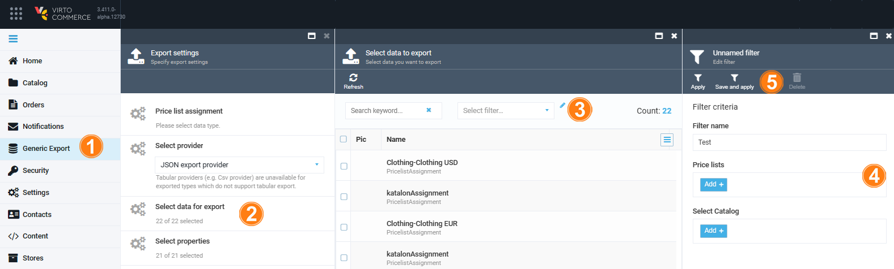

# Advanced Filtering

The advanced filter enables users to apply various filter criteria when selecting data for export:

| Data type to export   	| Applicable filter criteria                                                            	|
|-----------------------	|----------------------------------------------------------------------------------------	|
| Products              	| Catalogs Categories  Search in products variations  Search in child categories 	|
| Catalog               	| Catalogs                                                                                 	|
| Price                 	| Price lists  Products  Modified since...                                           	|
| Price list            	| Currencies                                                                   	            |
| Price list assignment 	| Price lists  Select catalog                                                   	        |

To apply advanced filtering:

1. Click **Generic Export** in the main menu.
1. In the next **Export settings** blade, click **Select data for export**. 
1. In the next blade, click {: width="30"} next to the **Select filter** field. 
1. In the next **Edit filter** blade, set the filters.
1. Click **Apply** in the toolbar to apply the filter for the current export procedure. 

  Click **Save and apply** to apply the filter for the current export procedure and save it for further actions.

