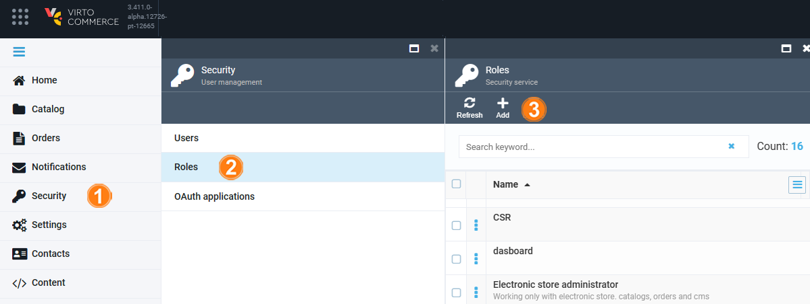

# Assign Permissions

To assign access to export functionality to users, the administrator should:

1. [Create a role and assign permissions](assigning-permissions.md#create-roles-and-assign-permissions) to the created roles.
1. [Assign the roles](assigning-permissions.md#assign-roles-to-users) with permissions to the users.

## Create roles and assign permissions

To create a new role:

1. Click **Security** in the main menu.
1. In the next blade, click **Roles** to open the **Roles** blade.
1. Click **Add** in the toolbar.

	

1. Fill in the following fields and select the required permissions:

	

1. Click **Create** to save the changes.

## Assign roles to users

{: width="25"} [Assigning roles to users](../security/managing-users.md#assign-roles-to-users)

