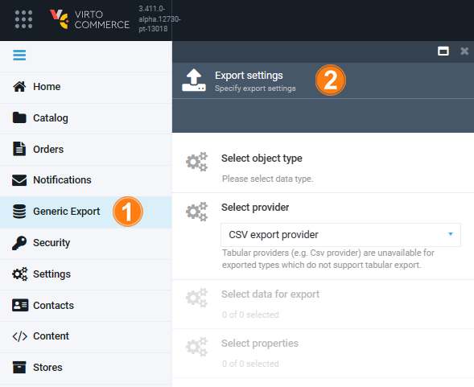
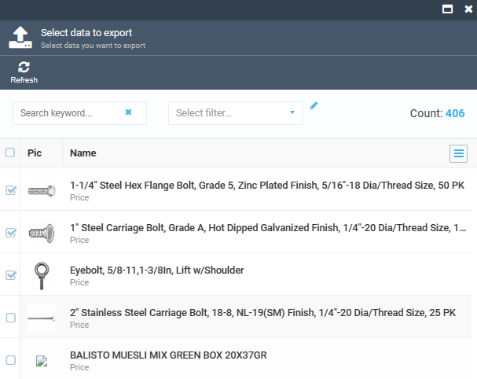
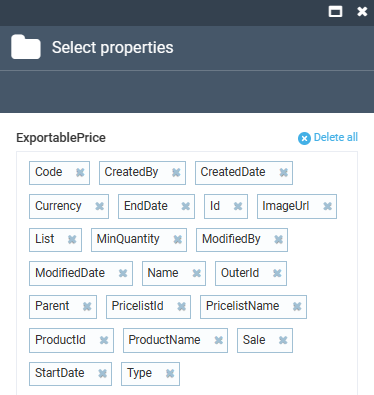
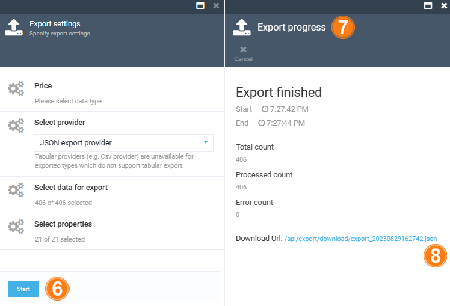

# Data Export 

Once the user gets access to the data export functionality, they can use the **Generic Export** module for exporting data.

To start the data export:

1. Click **Generic Export** in the main menu to open the **Export settings** blade.

    {: width="500"}

1. Click **Select object type** to select one data type you want to export:
    * Catalog product data with related objects. Supports JSON and CSV.
    * Catalog data with related objects. Supports JSON.
    * Prices without related objects.
    * Price list assignment.
    * Price lists.
1. Click **Select provider** to select an export provider from a drop-down list:
    * JSON.
    * CSV.

    !!! note
        Tabular providers (e.g. CSV provider) are unavailable for exported types which do not support tabular export.

1. Click **Select data for export** to check the required items, then click **OK**. [Advanced filtering](advanced-filtering.md) is available. 

    !!! note 
        Some data sources do not support export of specific selected entities. Use filter to limit the exported data set.

    {: width="500"}

1. Click **Select properties** to specify the properties to be included into the export file, then click **OK**.

    

1. In the **Export settings** blade, click **Start** to start data export.
1. The export progress is displayed in the new blade.
1. Once the export process is finished, a link to the export file is displayed, allowing the user to access and download the exported file.

    {: width="600"}

 
 
********

    <a href="../assigning-permissions">← Assigning permissions</a>
    <a href="../advanced-filtering">Advanced filtering →</a>

