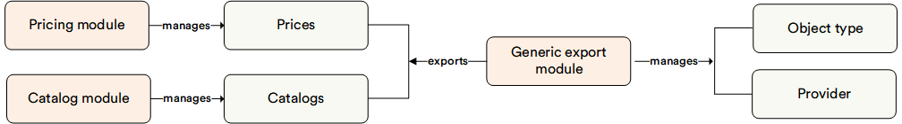

# Overview

The **Generic Export** module provides the ability to export data from the Catalog and Pricing modules. Before starting the export, the user can first filter the data by object type and properties, select the export provider using the advanced filter.

## Key features

The diagram below illustrates the functionality of the **Generic Export** module:

{: style="display: block; margin: 0 auto;" }

With the Generic Export Module, you can:

* [Assign permissions](assigning-permissions.md). Only users with the Export reader role and permissions have access to Generic Export function.
* Apply [advanced filters](advanced-filtering.md) application before starting the export.
* [Export data](exporting-data.md) in JSON and CSV format.

 
 
********

    <a href="../../gdpr/overview">← GDPR module overview</a>
    <a href="../assigning-permissions">Assigning permissions →</a>

