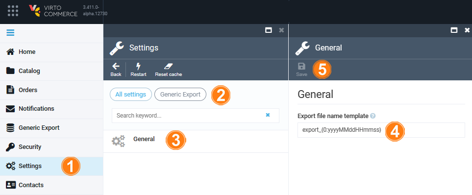

# Settings

To configure Generic Export settings:

1. Click **Settings** in the main menu.
1. In the search field of the next blade, type **Generic Export** to find the settings related to customer.
1. Click **General**.
1. In the next blade, configure the template that will be used to generate exported file name. The default template is `export_{0:yyyyMMddHHmmss}`, where 0 is a date and the UTC time of file generation. 

    {: width="700"}

1. Click **Save** in the toolbar to save the changes.

Your settings have been saved.

 
 
********

    <a href="../advanced-filtering">← Advanced filtering</a>
    <a href="../../news/overview">News module overview→</a>

