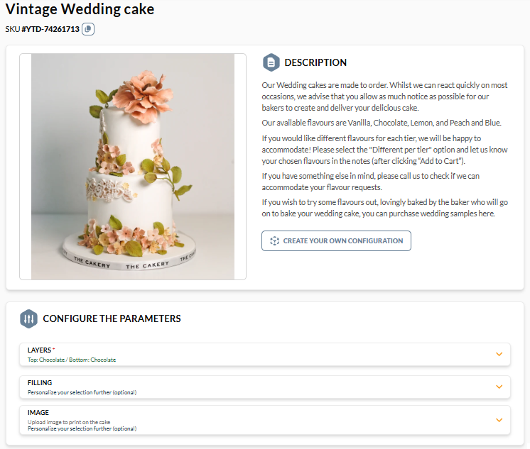
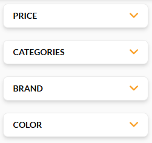
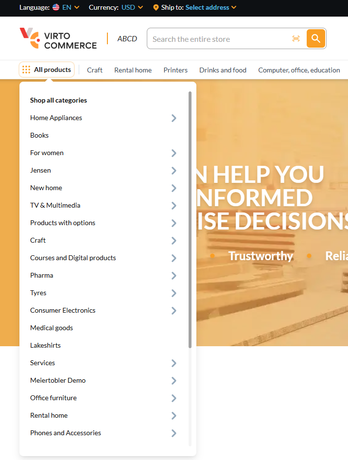
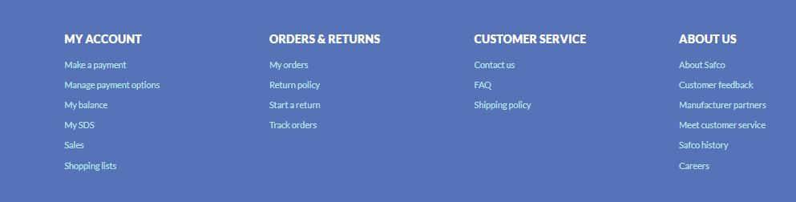
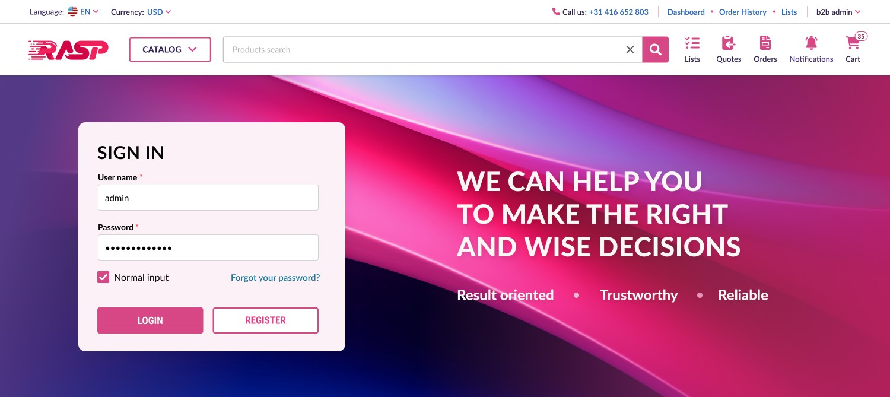
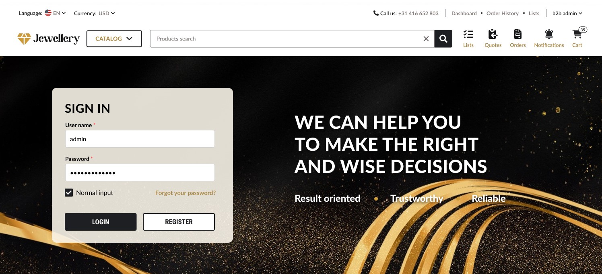
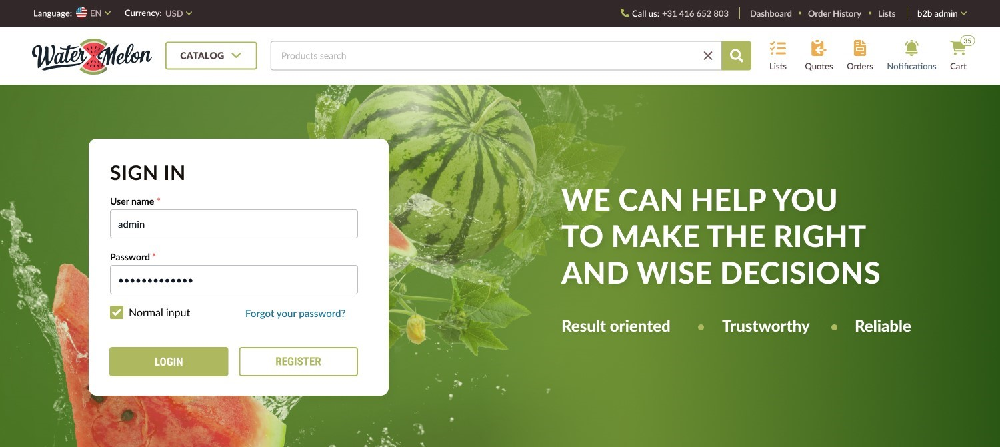
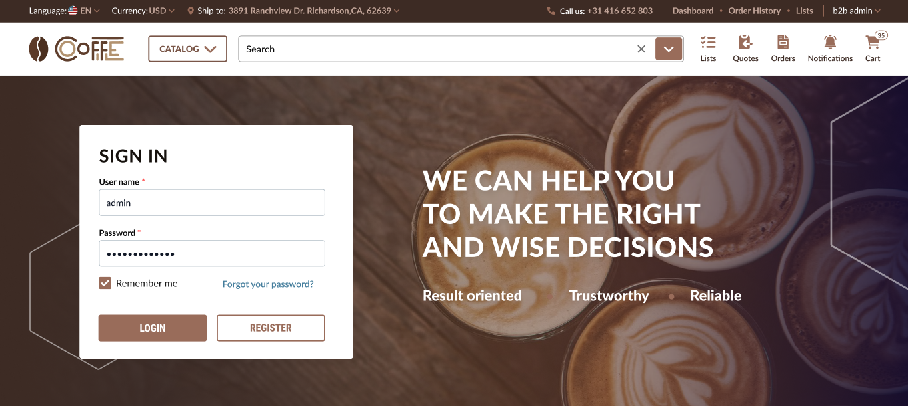
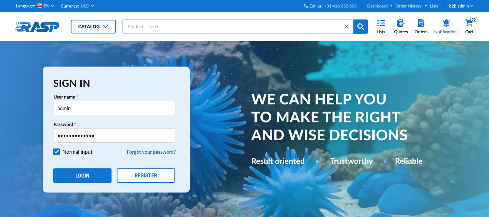
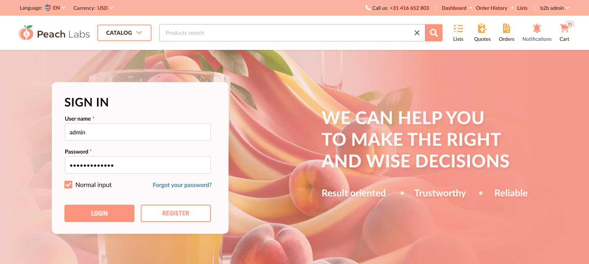

# Glossary

This glossary explains Virto Commerce business and operations vocabulary used throughout the user documentation, and maps key terms to their equivalents in other ecommerce platforms. Use it as a reverse lookup when searching for a concept you know by a different name.

For developer vocabulary, such as DDD patterns, .NET interfaces, or extensibility APIs, see the [Developer guide glossary](../../developer-guide/glossary.md).

## Admin UI
Same as **Platform** and **Back office**. An administrative interface of the Virto Commerce Platform where internal users manage and configure commerce operations, including catalogs, inventory, pricing, orders, customers, and system settings.

## Asset
A file (such as an image, video, document, or media resource) that is uploaded to the platform and linked to a product, category, or catalog to provide additional visual or informational content.

## Association
A tool that allows you to add a block of related items to a product or multiple products. For example, this could be a widget with related products or accessories that go with the product in question.

## Back office
Same as **Admin UI** and **Platform**. An administrative interface of the Virto Commerce Platform where internal users manage and configure commerce operations, including catalogs, inventory, pricing, orders, customers, and system settings.

## Bill of materials
A special type of Product that is actually a list of materials required for a specific item purchased by the customer that can be created for internal purposes.

## Catalog
A module offered by the Virto Commerce Platform that allows you to create your own product catalog linked to one or more stores. A typical catalog houses various categories of products and their variations.

## Catalog property
An extra field that admins can add to a catalog, category, product, or product variation from the Admin UI to record standard product information such as size, color, brand, or weight. Catalog properties accept typed values and dictionary lookups, support multilingual content, and cascade down the catalog hierarchy so a variation receives its product's catalog properties, a product its category's, and a category its catalog's. They power faceted search, filtering, and product card display on the storefront.

Equivalent in other ecommerce platforms:

| Virto Commerce | Shopify | Adobe Commerce (Magento) | commercetools | BigCommerce |
| --- | --- | --- | --- | --- |
| Catalog property | Product option | Product attribute | Product type attribute | Product option |

See also the [Developer guide glossary](../../developer-guide/glossary.md#catalog-property).

## Category
Each category acts as a container, or folder, that houses various products of a particular type; these can be both physical and digital products. For example, a consumer electronics site might have categories such as laptops, tablets, smartphones, cameras, etc.

## Company
Same as **Organization**. A profile for an entire company, within which you can store employee profiles, other company profiles, and those of individual customers related to that company.

## Contact (Customer)
A profile for a customer of your store; may be either an individual customer or a member of a company.

## Contract
A time-based relationship between the customer company (companies), the price list created within the contract, and the selected store.

## Contract code
A unique code of the contract. Once a contract is created, the system creates a user group with the same name as the contract code. This user group is automatically terminated when the associated contract is terminated.

## Contract name
The name of the contract that is visible in the contract list.

## Configurable product
A product type that lets customers choose from predefined options or attributes before adding the item to the cart

{: style="display: block; margin: 0 auto;" }

## Customers
The companies and contacts to whom the contract prices apply.

## Digital product
Any tangible product that the store owner can list in the Store. Digital products have unique attributes such as download type, maximum downloads, etc., unlike physical products; no shipping or inventory attributes may apply to such products.

## Dynamic property
An extra field that admins can add to any Virto Commerce object that supports dynamic properties, from the Admin UI. Dynamic properties capture, store, and display unique, nonstandard information.

Equivalent in other ecommerce platforms:

| Virto Commerce | Shopify | Adobe Commerce (Magento) | commercetools | BigCommerce |
| --- | --- | --- | --- | --- |
| Dynamic property | Metafield | Custom attribute (EAV) | Custom field | Metafield |

See also the [Developer guide glossary](../../developer-guide/glossary.md#dynamic-property).

## Employee
A profile of an employee working for a specific company.

## End date and Start date
Dates that define the active period of a contract, promotion, or other time-based entity.

## Facet
A set of properties grouped together (e.g., size and color).

{: style="display: block; margin: 0 auto;" }

## Fulfillment center
Same as **Warehouse**. Processing unit involved in receiving, processing, and delivering orders to end customers.

## GTIN, or Global Trade Item Number
Part of a numerical code used to uniquely identify a product.

## Inheritance
A technique that allows entities at different levels to inherit tags. Tags can be inherited both **upwards** (e.g. a category inherits the tags of product) and **downwards** (e.g. a product inherits the tags of its category).

## Inventory
Same as **Stock**. The quantity of a product available at a specific fulfillment center.

## Link lists
Collections of hyperlinks organized to facilitate efficient navigation through the catalog and provide quick access to its items via the mega menu or footer:

{: style="display: block; margin: 0 auto;" }

{: style="display: block; margin: 0 auto;" }

## Modified price
A price that is different from the default price because it has been updated by the user.

## Module
A self-contained unit of functionality that admins install into the Virto Commerce Platform to compose a tailored solution from independent pieces such as Catalog, Pricing, Orders, Marketing, or integrations. Each module brings its own back-end features and the admin screens to manage them; an App, by contrast, contributes mostly user interface. The base installation is intentionally minimal: admins add only the modules their solution requires and can later install, update, or remove them from the Admin UI.

Equivalent in other ecommerce platforms:

| Virto Commerce | Shopify | Adobe Commerce (Magento) | commercetools | BigCommerce |
| --- | --- | --- | --- | --- |
| Module | n/a (uses Apps) | Extension | n/a (composable architecture) | n/a (uses Apps) |

See also the [Developer guide glossary](../../developer-guide/glossary.md#module).

## Organization
Same as **Company**. A profile for an entire company, within which you can store employee profiles, other company profiles, and those of individual customers related to that company.

## Physical product
Any tangible product that the shop owner can list in the shop. Physical products have a unique Track Inventory attribute that digital products do not have. Shipping and Fulfillment Center attributes are also relevant to them.

## Platform
Same as **Admin UI** and **Back office**. An administrative interface where internal users manage and configure commerce operations, including catalogs, inventory, pricing, orders, customers, and system settings.

## Product
A basic entity in Virto Commerce's Catalog module, a product is a basic type of item that can be created and listed on an ecommerce site. You can choose to create entries for both physical and digital products. There are also special types of products, such as bills of materials, variations, and configurables.

## Product with bill of materials
A physical product that comes with a bill of materials (a list of additional items). It can be used for specific promotions and requires physical shipping

## Quote
Formal document from a seller that provides a potential buyer with the estimated cost of specific products or services, along with the terms and conditions of a potential sale.

## SKU
Short for **Stock Keeping Unit**, an SKU is an alphanumeric code used to track product inventory. By adding SKUs to each product variation, store owners can easily track the number of products available and create thresholds to determine if a new order is needed.

## SEO
Virto Commerce catalog offers dedicated SEO tools to increase traffic to the ecommerce store. In particular, one can add meta titles, descriptions, keywords and image alt-texts for a specific product to make it more discoverable on the web.

## Stock
Same as **Inventory**. The quantity of a product available at a specific fulfillment center.

## Store
Any digital means of marketing and/or selling products created with the Virto Commerce Platform and its modules. Technically, this can be an ecommerce website, a mobile app, etc.

## Theme
A package of assets that defines the visual appearance and layout of your Frontend.

=== "purple-pink"

    

=== "black-gold"

    

=== "watermelon"

    

=== "coffee"

    

=== "ocean"

    

=== "peach"

    

## Variation
Each product may have one or more variations; for example, a cell phone may come in different colors: blue, white, black, etc. You can create variations based on color, size, and other properties that you configure.

## Vendor (Merchant, Seller)
A profile for a vendor you work with.

## Virto OZ
An integrated AI-powered assistant designed to help users navigate, learn, and work more efficiently with Virto Commerce.

## Warehouse
Same as **Fulfillment center**. Processing unit involved in receiving, processing, and delivering orders to end customers.

 
 
********

    <a href="../white-labeling/overview">← White Labeling module overview</a>
    <a href="../integrations/overview">Integrations overview →</a>

