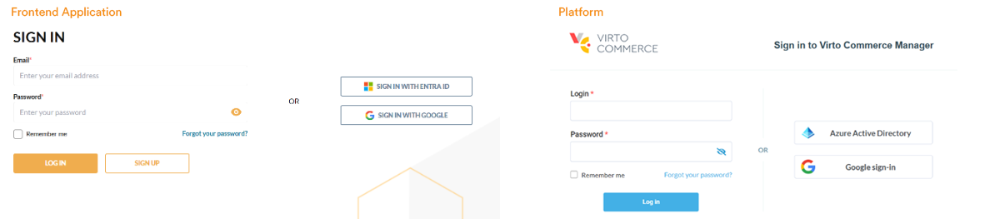

# Google SSO

Google Single Sign-On (SSO) is a module that provides users with a simplified sign-in experience. It allows users to access multiple applications with a single set of credentials, eliminating the need to remember different usernames and passwords for each application.

The Google SSO module integrates Virto Commerce with Google to provide secure authentication and authorization for cloud and on-premises applications. This helps to improve productivity, security, and user satisfaction by reducing the number of times users are prompted for their credentials.

## Key features

The Google SSO module can be integrated with both the Virto Commerce Platform and the Frontend Application:

{: width="25"} [Using Google as SSO provider in the Platform](../../../developer-guide/Fundamentals/Security/extensions/adding-google-as-sso-provider)

{: width="25"} [Using Google as SSO provider in the Frontend Application](../../../../storefront/developer-guide/authentication/adding-google-as-sso-provider)
